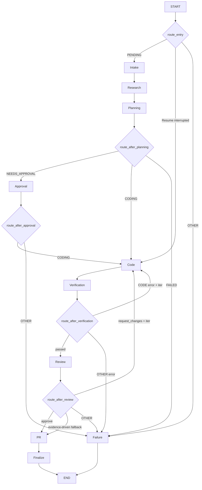
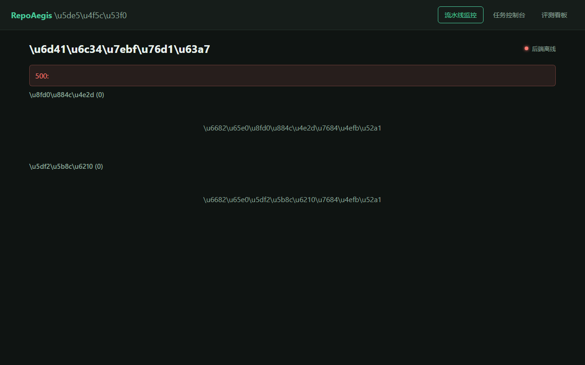
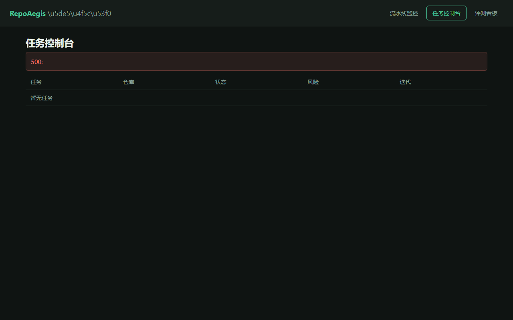
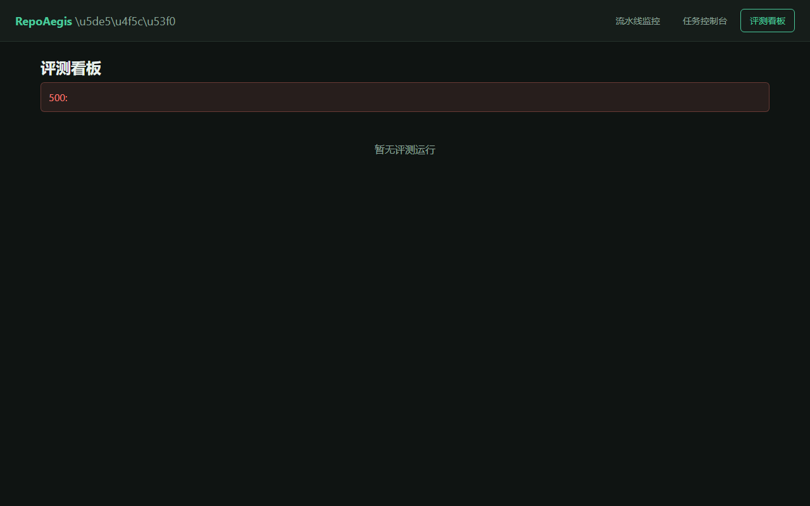

<p align="center">
  <picture>
    <source media="(prefers-color-scheme: dark)" srcset="docs/assets/repo-aegis-mark-reversed.svg">
    
  </picture>
</p>

<h1 align="center">RepoAegis</h1>

<p align="center">
  Policy-controlled, evidence-backed issue fixing pipeline: GitHub Issue → locate code → produce patch → sandbox verification → human approval → submit PR.
</p>

<p align="center">
  <a href="https://github.com/ETOLucy/RepoAegis/actions/workflows/ci.yml"></a>
  <a href="https://github.com/ETOLucy/RepoAegis/actions/workflows/eval-smoke.yml"></a>
  <a href="https://www.python.org/"></a>
  <a href="LICENSE"></a>
</p>

<p align="center">
  <a href="README.md">简体中文</a>
</p>

---

## Project Positioning

RepoAegis is a **policy-controlled, evidence-backed** issue fixing pipeline. Given a GitHub Issue, it automates the full flow from understanding the problem to submitting a PR, ensuring safety and traceability at every step.

Unlike fully automated repair tools, RepoAegis prioritizes: **every remote write requires human confirmation**, **every code change is backed by evidence**, **every execution runs in an isolated environment**.

## Core Design Principles

- **Immutable task boundaries**: Tenant, repository, and target commit are fixed at task start and cannot be changed afterward. Prevents the agent from drifting out of scope during reasoning.
- **Least privilege**: Tools are denied by default; capabilities are granted only as needed for each stage. The agent cannot access approval tools during the coding stage, or write tools during the review stage.
- **Human approval**: Remote writes require an approval envelope. Human-in-the-loop confirms the plan, target commit, verification commands, and tool scope before execution.
- **Isolated execution**: Tests and commands run in Docker sandboxes with digest-pinned images, non-root users, read-only root filesystems, and all capabilities dropped. Commands never touch the host environment.
- **Traceability**: Every operation has concurrency control and replayable side effects. Git diffs, change records, and verification evidence are fully preserved for post-mortem audit.

## Architecture Overview

The core orchestration is built on LangGraph's StateGraph, a **10-node conditional routing graph + bounded retry + evidence-driven fallback**:



## Frontend Dashboard

RepoAegis provides a web-based frontend dashboard for pipeline monitoring, task management, and evaluation results:

| Module | Screenshot |
|--------|-----------|
| Pipeline Monitor |  |
| Task Console |  |
| Evaluation Dashboard |  |


- **Conditional routing graph**: Not a linear pipeline — each node is followed by a conditional branch, dynamically determined by routing functions based on state + iteration count + verification results. There are 5 routing decision points (route_entry, route_after_planning, route_after_approval, route_after_verification, route_after_review).
- **Bounded retry**: Verification failure (CODE error + iteration < max) → retry code; review request_changes + iteration < max → retry code. Maximum retries: max_iterations.
- **Evidence-driven fallback**: If review repeatedly requests changes but verification passes, changes are within declared files, and risk is low, the pipeline still proceeds (with a warning record).
- **Human approval**: The approval node uses LangGraph's interrupt (human-in-the-loop), with an approval envelope carrying a plan_hash digest to prevent tampering after approval.

## Module Details

### Intake (Task Understanding)

**What it does**: Receives a GitHub Issue and extracts structured metadata — task_type (bugfix/feature/test/documentation/dependency/refactor), summary, acceptance_criteria, constraints, unknowns.

**Why**: Issues are natural language text that needs to be converted into a machine-processable specification format. However, Intake only does initial analysis; calibration happens in subsequent stages.

### CalibrationJudge (Standard Calibration)

**What it does**: After each stage (research/planning/coding), calls CalibrationJudge to check whether the intake standards (task_type, acceptance_criteria, constraints, unknowns) are still valid. Calibration results are written as a diff/overlay; downstream stages see the adjusted standards.

**Why**: Intake's initial analysis may be inaccurate. After Research collects evidence, it may discover that the task_type was wrong (e.g., Intake said "feature" but evidence shows "bugfix"). CalibrationJudge is an independent module that doesn't modify Intake's output but generates a diff for downstream consumption, maintaining data flow unidirectionality.

### Rewriter (Query Rewriting)

**What it does**: In the Research node, calls `rewrite_queries_with_model()` to rewrite the issue title + body + search hints into multiple targeted search queries. Each query carries a `SearchKind` (18 kinds) for the search backend to select the appropriate retrieval strategy.

**Why**: A single issue description may require different search strategies for different aspects. The Rewriter decomposes the issue into multiple search dimensions, each with the optimal retrieval strategy, improving search coverage.

### Research (Evidence Collection)

**What it does**: Executes the rewritten queries through the search system. Each query carries a `kind` that maps to a search strategy. Searches are executed in parallel across primary and secondary strategies, with results fused via RRF (Reciprocal Rank Fusion). Supports 18 SearchKind mappings.

**Search strategy mapping table**:

| Rewriter Kind | Primary Search | Secondary Search | Description |
|---|---|---|---|
| exact | LEXICAL + BM25 | BM25 | Exact identifier, error string |
| path | LEXICAL + BM25 | BM25 | File path hints |
| error | LEXICAL + BM25 | BM25 | Error messages, tracebacks |
| symbol | SYMBOL + BM25 | BM25 + VECTOR | CamelCase symbols, class/function names |
| definition | SYMBOL + BM25 | BM25 + VECTOR | Definition lookup |
| history | HISTORY + BM25 | BM25 | Git history queries |
| general | BM25 + VECTOR + OPENSEARCH | BM25 + VECTOR | General fallback |
| explore | VECTOR + BM25 | BM25 + VECTOR | Exploratory search |
| test | LEXICAL + BM25 | BM25 + VECTOR | Test-related |
| config | LEXICAL + BM25 | BM25 | Configuration-related |
| dependency | LEXICAL + BM25 + SYMBOL | BM25 | Dependencies/imports |
| regex | LEXICAL + BM25 | BM25 | Regex pattern matching |
| schema | SYMBOL + BM25 + VECTOR | BM25 + VECTOR | Database schema |
| performance | BM25 + VECTOR | BM25 + VECTOR | Performance optimization |
| security | LEXICAL + BM25 | BM25 | Security vulnerabilities |
| api | SYMBOL + BM25 | BM25 + VECTOR | API interfaces |
| ui | LEXICAL + BM25 | BM25 | Frontend UI |
| ci_cd | LEXICAL + BM25 + HISTORY | BM25 | CI/CD configuration |

### Planning (Plan Generation)

**What it does**: Generates an implementation plan based on Research evidence, containing step list, involved files, and verification plan. Also assesses risk level (low/medium/high/critical).

**Why**: Forces the agent to think before acting. Risk level determines whether human approval is needed — high-risk tasks must enter the approval stage.

### Approval (Human Approval)

**What it does**: High-risk tasks enter the human approval stage. The ApprovalEnvelope contains plan_hash (SHA-256 tamper-proof digest), declared_files, allowed_tools, and verification_plan. plan_hash uses canonical JSON + SHA-256 to generate an irreversible digest.

**Why**: Remote writes may directly affect production repositories. The approval envelope ensures human confirmation before execution, and plan_hash guarantees the plan can't be tampered with after approval.

### Coding (Code Generation)

**What it does**: Generates patches based on the plan using exact-text replacement (old_text → new_text), ensuring undeclared files are not modified.

**Why**: Exact-text replacement is more reliable than line-number patches, and won't break if code lines shift. Declared file lists ensure the agent doesn't modify files outside the plan.

### Verification (Sandbox Verification)

**What it does**: Runs tests in a Docker sandbox to verify patch correctness.

**Why**: Isolated execution prevents malicious code from affecting the host. The sandbox uses digest-pinned images for immutability, non-root users for reduced privileges, read-only root to prevent persistence, and all capabilities dropped to minimize attack surface.

### Review (Code Review)

**What it does**: LLM reviews the generated patch, checking if it meets the acceptance criteria.

**Why**: Adds an automated quality assurance layer to ensure the patch doesn't introduce new issues and meets the original requirements. Review and Verification complement each other — verification ensures "doesn't break", review ensures "does it right".

### Localizer (Localization Loop)

**What it does**: Planner + Explorer loop, up to 3 rounds, supporting 4 actions (search / read / blame / finish).

**Why**: Search results may not be precise enough. The Localizer narrows down through multi-round interaction, from file-level to function-level to line-level, eventually giving precise modification locations.

## Quick Start

### Prerequisites

- Python 3.12+
- Node.js 18+
- Docker (optional, for sandbox verification)
- OpenAI API Key (or compatible endpoint)

### Installation

```bash
# Clone the repository
git clone https://github.com/ETOLucy/RepoAegis.git
cd RepoAegis

# Backend
python3 -m venv .venv
source .venv/Scripts/activate
pip install -e ".[dev]"

# Frontend
cd web && npm install && cd ..
```

### Configuration

Create a `.env` file (or set environment variables):

```bash
export OPENAI_API_KEY="sk-your-api-key"
export OPENAI_BASE_URL="https://api.openai.com/v1"  # optional, for compatible endpoints
export REPO_AGENT_API_TOKENS='{"dev-token":"dev-tenant"}'
```

### Start Development Servers

Two terminals are needed:

```bash
# Terminal 1: Backend API
cd RepoAegis
export REPO_AGENT_API_TOKENS='{"dev-token":"dev-tenant"}'
export OPENAI_API_KEY="sk-your-api-key"
.venv/Scripts/python.exe -m uvicorn repo_maintenance_agent.main:build_application --host 127.0.0.1 --port 8000

# Terminal 2: Frontend Console
cd RepoAegis/web
npx vite --host 127.0.0.1 --port 5173
```

### Verify

```bash
curl http://127.0.0.1:8000/v1/health
# Expected: {"status":"ok"}
```

### Run a Fix Task

```bash
curl -X POST http://127.0.0.1:8000/v1/tasks \
  -H "Authorization: Bearer dev-token" \
  -H "Content-Type: application/json" \
  -d '{
    "issue_url": "https://github.com/owner/repo/issues/1",
    "repo_url": "https://github.com/owner/repo.git",
    "commit_sha": "abc123..."
  }'
```

## Tech Stack

| Layer | Technology | Description |
|---|---|---|
| Language | Python 3.12+ | pyproject.toml requires >=3.12 |
| Orchestration | LangGraph (StateGraph) | interrupt + conditional edges |
| Model Access | openai SDK (Responses API) | structured() unified entry, Pydantic schema validation |
| Web | FastAPI + uvicorn | API service |
| Search | Custom: BM25 / AST symbol / Vector / LEXICAL / History / OpenSearch | 18 SearchKind mappings, RRF fusion |
| Storage | SQLAlchemy + Postgres (optional) / in-memory | artifacts / memory / queue |
| Sandbox | Docker (digest-pinned images, non-root, read-only root) | Isolated execution |
| Frontend | React + Vite console | web/ |
| Evaluation | Custom harness (SWE-bench official swebench package validator + Inspect scaffold skeleton) | Single-track (custom) |

## Security Design

- **Deny-by-default tool authorization**: Tools are denied by default; capabilities are granted only per stage. The agent cannot invoke tools beyond its authority.
- **Approval envelope**: Remote writes are bound to an approval envelope with plan_hash (SHA-256) tamper protection. Any plan change after approval causes a hash mismatch.
- **Recursive redaction**: Redactor recursively detects and replaces secrets, tokens, passwords, API keys, and other sensitive information to prevent leaks.
- **Path traversal protection**: Checks all file paths against the workspace root, rejecting any path containing `..` or absolute path traversal attempts.
- **Sandbox isolation**: Docker sandbox runs tests with digest-pinned images for immutability, non-root users for reduced privileges, read-only root filesystem, and all capabilities dropped.

## Related Projects

- [AegisEvo](https://github.com/ETOLucy/AegisEvo) — Agent configuration genome evolution optimization, companion to RepoAegis.
- [UK AISI Inspect](https://github.com/UKGovernmentBEIS/inspect_ai) — Industry-standard agent evaluation framework. RepoAegis provides a scaffold skeleton (`inspect/`); replay scoring via `swe_bench_scorer` verified (3/8 resolved), generate mode wiring not yet complete.

## License

Apache License 2.0. See [LICENSE](LICENSE).
