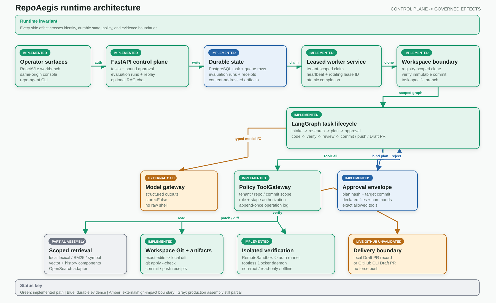
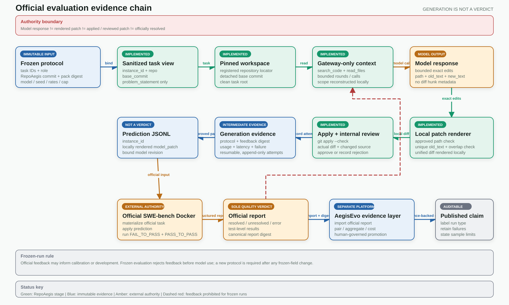

<p align="center">
  <picture>
    <source media="(prefers-color-scheme: dark)" srcset="docs/repo-aegis-mark-reversed.svg">
    
  </picture>
</p>

<h1 align="center">RepoAegis</h1>

<p align="center">
  A policy-controlled repository maintenance agent for evidence-backed patches and reviewable delivery.
</p>

<p align="center">
  <a href="https://github.com/ETOLucy/RepoAegis/actions/workflows/eval-smoke.yml"></a>
  <a href="https://www.python.org/"></a>
  <a href="LICENSE"></a>
</p>

RepoAegis is built as an AI control plane rather than a chat wrapper. Typed state,
tenant isolation, deterministic routing, tool authorization, leased workers, hybrid retrieval,
container isolation, and reproducible evaluation sit between a model decision and every side
effect.


> The screenshot shows the checked-in deterministic example suite. It demonstrates comparison,
> gate, and replay behavior; it is not a published model benchmark.

## Why This Exists

Repository maintenance agents operate on hostile input and high-impact tools. Issue text can carry
prompt injection, source trees can contain secrets, tests execute untrusted code, and remote writes
can affect production repositories. A useful system therefore needs more than an agent loop:

- immutable task scope: tenant, repository, and commit
- deny-by-default tools with stage-aware permissions
- approval-envelope-bound human approval for remote writes
- isolated execution with bounded resources and network policy
- durable concurrency control and replay-safe side effects
- evaluation that distinguishes correctness, safety, retrieval, and cost

This repository implements those boundaries end to end.

## Related Work & Positioning

RepoAegis sits at the intersection of agent evaluation, safety gating, and repository-level
governance. Independent research supports the core design choice — govern the repository, not
the agent:

- **Govern the Repository, Not the Agent** (Russo, 2026; arXiv:2606.28235) analyzes more than
  930,000 agent-authored pull requests and finds that integration friction is largely a property
  of the repository, not of any single agent: about half of the friction variance survives
  controls for contribution, author, size, and agent, and agent-authored contributions
  concentrate repository-level friction roughly twice as much as human ones (ICC 0.30 vs 0.16).
  The paper concludes that AI-native software should be measured and governed at the ecosystem
  (repository) level, not one agent at a time. RepoAegis is a concrete implementation of that
  thesis: repository-scoped gates (deny-by-default tools, approval-bound remote writes, patch
  safety, independent review) and evaluation that measures correctness, safety, retrieval, and
  cost together.
- **Making Agent-Mediated Contributions Governable** (2026; arXiv:2607.15769) proposes a
  project-level governance manifest linking contributor-side evidence preparation with
  maintainer-side verification. RepoAegis operationalizes the same boundary in code: every side
  effect crosses a typed adapter and a reviewable evidence record.
- **Mendel Gödel Machine** (2026; arXiv:2608.07645) and **From Admission to Invariants** (2026;
  arXiv:2604.17517) study self-improving agents and delegated-agent deviation respectively;
  AegisEvo applies their shared discipline — gate change by measured evidence, not by assertion —
  to agent-configuration genomes via paired-bootstrap significance plus safety veto.

Positioning against adjacent tooling:

| Tool / line of work | Focus | RepoAegis / AegisEvo position |
|---|---|---|
| Inspect AI (UK AISI) | Authoritative agent evaluation harness | We ship an Inspect bridge scaffold so official runs can reuse the standard framework; Inspect executes and scores, RepoAegis adds release gates, safety, and cost accounting |
| OpenAI Evals / DeepEval / promptfoo | LLM evaluation frameworks | They score model outputs; RepoAegis evaluates agent side effects (tools, sandbox, cost, safety) end to end |
| LangSmith / Braintrust | Eval + trace + gates for LLM applications | They gate prompt/model-call regression by threshold; AegisEvo gates agent-configuration genomes by paired bootstrap plus safety veto |
| MLflow / SageMaker Model Registry | Model-weight versioning and promotion | AegisEvo governs agent-configuration genomes (not weights) with content-addressed lineage and statistical gates |
| Garak / PyRIT / HarmBench | Attack-surface scanning | Complementary: they probe the model attack surface; RepoAegis enforces deny-by-default execution-time boundaries |

## System Map



[Editable Excalidraw source](docs/diagrams/runtime-architecture.excalidraw) ·
[PNG export](docs/diagrams/runtime-architecture.png) ·
[Official evaluation evidence chain](docs/diagrams/official-evaluation-evidence.svg)
([editable source](docs/diagrams/official-evaluation-evidence.excalidraw),
[PNG](docs/diagrams/official-evaluation-evidence.png))

The Python control plane owns identity, state, policy, evidence, and orchestration. Repository code
executes only in assigned workspaces or language-specific Docker sandboxes.

## Implemented Guarantees

| Boundary | Implementation |
|---|---|
| Agent state | Strict Pydantic models and legal lifecycle transitions |
| Concurrency | Atomic enqueue, optimistic versions, leased claims, rotating fencing IDs |
| Retrieval | Lexical and semantic adapters with deterministic reciprocal-rank fusion |
| Tool use | Tenant/repository/commit scope plus role and stage authorization |
| Remote writes | Human decision bound to the plan, target commit, declared files, verification commands, and exact tool scope |
| Patch safety | Exact-text proposals, approved-path enforcement, local diff rendering, and `git apply --check` preflight |
| Independent review | Gateway-collected Git diff, post-change source, acceptance criteria, and verification evidence |
| Commands | Argument arrays, executable allowlist, timeout, output limit, sanitized environment |
| Sandbox | Digest-pinned image, non-root user, read-only root, dropped capabilities, offline checks |
| Model output | Provider-specific structured JSON with strict local validation; Responses calls use `store=False`; the model does not author diff hunk metadata |
| Coding context | Gateway-only search/read requests with fixed round and tool-call ceilings |
| Evaluation | Concurrent suites, retries, provenance, baseline deltas, hard gates, deterministic replay |
| Privacy | Recursive redaction plus current-tree and reachable-history publication scanning |
| Browser surface | Same-origin console with CSP and in-memory-only bearer identity |

## Evaluation Harness

The Harness evaluates a versioned suite under a bounded concurrency limit. It preserves manifest
order, retries only timeout and infrastructure failures, and records:

- immutable repository commit and dataset version
- provider, model, prompt, tool-schema, and policy versions
- deterministic seed and normalized environment fingerprint
- observation, attempts, failure category, latency, retrieval, calls, and tokens per case
- aggregate resolution, Recall@10, MRR, regressions, safety rate, and p50/p95 latency
- candidate-minus-baseline deltas
- individual release-gate checks and one final decision

Replay creates a new run for selected cases and never mutates the source evidence.

Run the included credential-free example:

```powershell
.venv\Scripts\python.exe -m repo_maintenance_agent.cli evaluate-suite `
  examples/evaluation/suite.json `
  examples/evaluation/observations.json `
  --json-report artifacts/evaluation/example.json `
  --markdown-report artifacts/evaluation/example.md `
  --candidate-label local-example
```

The command writes both reports before returning exit code `1` for a failed gate, which makes it
usable as a CI release check.

### SWE-bench evidence labels

RepoAegis keeps generation and quality evidence separate:

- **one-shot generation**: a prediction was produced without prior official-test feedback;
- **officially resolved**: the official SWE-bench Docker harness passed all required tests;
- **feedback-assisted calibration**: a development rerun consumed a previous official failure;
- **frozen evaluation**: the CLI rejects development feedback and preserves the one-shot boundary.

Feedback-assisted calibration is useful for improving the agent loop, but it is not reported as a
one-shot or frozen benchmark score. See [the evaluation integrity guide](docs/evaluation.md) for
the feedback contract and auditable resume behavior.


### Evaluation scale

#### Development iteration

RepoAegis was developed iteratively on a **200-instance subset** sampled from the full SWE-bench dataset (2,294 instances), with all Verified instances (500) excluded by unique ID to prevent data leakage. The development process focused on analyzing and resolving generation failures:

- **ValidationError (patch schema)** — the largest failure category (~45% of failures). Addressed by tightening structured output validation, adding retry logic with model feedback, and improving the patch rendering pipeline.
- **ToolExecutionError (apply/edit)** — improved workspace isolation and edit precision to reduce application failures.
- **RuntimeError (review/flow)** — hardened the agent execution graph and review gate logic.

This iterative loop — run on the development subset, classify failures, patch the root cause, re-run — drove the system from an initial <10% generation rate to the final evaluation result.

#### Final evaluation

After development iteration, the system was evaluated on a **200-instance subset** sampled from the industry-standard **SWE-bench Verified** (500 tasks). The evaluation campaign has completed.

> **Note:** This is a single-subset result, not a leaderboard claim. No baseline improvement claim is made until an aligned paired baseline is published. See [docs/evaluation.md](docs/evaluation.md) for full methodology and results.

- **Development set**: 200 instances from SWE-bench full (Verified excluded by unique ID)
- **Evaluation set**: 200-instance subset sampled from SWE-bench Verified 500 — held out until final evaluation
- **Status**: ✅ Evaluation complete — 74 / 200 (37.0%) end-to-end resolved (74/192 = 38.5% conditional on generation)


### Statistical rigor (tools for comparative experiments)

Comparisons carry paired-bootstrap uncertainty instead of bare point deltas:
`evaluation/significance.py` computes a reproducible 10,000-resample percentile interval
(seed-fixed), labels the direction (improvement / regression / inconclusive), and a
`resolution_statistical_significance` release gate fails on a significant regression and on
inconclusive small-sample deltas. `wilson_ci()` and the exact `clopper_pearson_ci()` report
honest intervals for small binary results, and `required_n_for_power()` makes the sample-size
assumption explicit instead of hiding it. Effect size is reported as `cohens_h()`, and
family-wise multiple-comparison control uses `holm_adjust()`. Aggregate reports also expose a mean
partial resolution ratio (`tests_passed_ratio`) and a cache-hit rate so cost is measured, not
guessed.

### LLM-as-Judge and model matrix

`evaluation/judge.py` adds rubric-based LLM judging (independent judge gateway, per-criterion
1-5 scores, rerun consistency) alongside the deterministic harness, plus an
agreement / disagreement rate between the two paradigms. `evaluation/model_matrix.py` runs the
same suite across several models with aligned seeds, prints a cost-quality table, and computes
pairwise deltas ready for the bootstrap gate.

### Dual-track evaluation, Inspect alignment, and red-team evaluation

Evaluation runs on two tracks that feed one gate: a fast self-hosted harness for CI/iteration,
and the UK AISI Inspect framework for authoritative runs.

- **Self-hosted harness (CI, seconds, no model calls)**: deterministic-fixture eval smoke gate
  (`.github/workflows/eval-smoke.yml`) plus the full versioned suite — concurrent, resumable,
  replay-safe, with release gates. See [docs/evaluation.md](docs/evaluation.md).
- **Inspect alignment (authoritative)**: `repo_maintenance_agent/inspect/` provides the bridge
  as a **scaffold** — dataset conversion, a SWE-bench progress scorer, a `.eval` log parser, and
  an agent-bridge skeleton — so official runs can reuse the industry-standard framework and
  baselines. The bridge is a designed integration plan (see
  [docs/inspect-integration.md](docs/inspect-integration.md)), not yet a shipped official
  submission; Inspect executes and scores, while statistical conclusions remain the single
  authority of the AegisEvo gates.
- **Red-team case set**: `examples/evaluation/redteam/` covers prompt-injection /
  unauthorized-tool / secret-exfiltration / path-traversal cases and asserts 100% deny-by-default
  interception — execution-time governance that attack-surface scanners do not provide.

## Web Workbench (AI Full-Stack)

A React + Vite workbench that talks to the control plane and a RAG chat endpoint:

- **Code Q&A (RAG)** `POST /v1/chat`: hybrid BM25 + symbol retrieval over the repo, cited
  answers via an OpenAI-compatible model (DeepSeek), reference paths/line ranges returned.
- **Task console** `/v1/tasks`: list, create, and inspect repository maintenance tasks.
- **Evaluation dashboard** `/v1/evaluations/runs`: evaluation runs and release gates.

Build the frontend and serve it:

```powershell
cd web
npm --registry=https://registry.npmmirror.com install
npm run build          # outputs web/dist
```

Set `REPO_AGENT_CHAT_REPO_ROOT` to a repo checkout to enable RAG chat. The chat engine is
`repo_maintenance_agent/chat.py`; retrieval lives in `search/index.py` (BM25/symbol/vector)
and `search/embeddings.py`.

## Quick Start

Requirements:

- Python 3.12
- Git
- Docker for sandbox and image execution

```powershell
python -m venv .venv
.venv\Scripts\python.exe -m pip install -e ".[dev,postgres,observability]"
.venv\Scripts\python.exe -m pytest --cov=repo_maintenance_agent --cov-report=term-missing
.venv\Scripts\python.exe -m ruff check src tests
.venv\Scripts\python.exe -m mypy src
```

Start the local API with a development-only identity:

```powershell
$env:REPO_AGENT_API_TOKENS='{"local-api-token":{"tenant_id":"tenant-local","subject":"local-reviewer"}}'
$env:REPO_AGENT_ENVIRONMENT='development'
.venv\Scripts\python.exe -m uvicorn repo_maintenance_agent.main:build_application --factory
```

Open:

- Operations console: `http://127.0.0.1:8000/console`
- OpenAPI: `http://127.0.0.1:8000/docs`
- Health check: `http://127.0.0.1:8000/health`

The console requests the bearer identity after load and keeps it only in JavaScript memory. It does
not use cookies, local storage, session storage, or URL parameters.

## CLI

Set the control-plane identity only in the current process:

```powershell
$env:REPO_AGENT_API_TOKEN='local-api-token'

repo-agent run owner/repository aaaaaaaaaaaaaaaaaaaaaaaaaaaaaaaaaaaaaaaa "Fix empty config"
repo-agent status TASK_ID
repo-agent approve TASK_ID PLAN_HASH --reason "Reviewed scope and verification plan"
repo-agent resume TASK_ID PLAN_HASH --reason "Approved for sandbox execution"
repo-agent cancel TASK_ID
```

`status` returns the reviewable plan, deterministic risk and reasons, plan hash, evidence summaries,
declared files, verification plan, and allowed tools. `approve` reads that envelope and submits its
target commit and tool scope with the decision. The API rejects stale hashes, commits, or tool sets;
any changed envelope requires a new decision. `approve --reject` records a rejection.

## API Surface

Authenticated task routes:

```text
POST /v1/tasks
GET  /v1/tasks
GET  /v1/tasks/{task_id}
POST /v1/tasks/{task_id}/approval
POST /v1/tasks/{task_id}/cancel
```

Task responses deliberately omit tenant identity and full retrieved content. Evidence summaries
contain only source, locator, and bounded summary fields needed for review.

Authenticated evaluation routes:

```text
POST /v1/evaluations/runs
GET  /v1/evaluations/runs
GET  /v1/evaluations/runs/{run_id}
POST /v1/evaluations/runs/{run_id}/replay
GET  /v1/evaluations/runs/{run_id}/report.json
GET  /v1/evaluations/runs/{run_id}/report.md
```

Cross-tenant and unknown object IDs have the same 404 response. Public response models omit tenant
identifiers and internal queue state.

## Local Infrastructure

The Compose profile defines the API, worker, PostgreSQL, OpenSearch, authenticated sandbox runner,
and a project-owned rootless Docker daemon. The worker and daemon share no network; the runner is
the only bridge, and no Docker socket or daemon port is exposed to the host. Exposed application
ports bind to loopback. OpenSearch security is disabled only in this local profile.

```powershell
$env:POSTGRES_PASSWORD='choose-a-local-password'
$env:REPO_AGENT_API_TOKENS='{"local-api-token":{"tenant_id":"tenant-local","subject":"local-reviewer"}}'
$env:SANDBOX_RUNNER_TOKEN='choose-a-separate-runner-token'
$env:REPO_AGENT_REPOSITORY_LOCATORS='{"owner/repository":"/operator/pinned/repository.git"}'
$env:REPO_AGENT_WORKER_TENANT_IDS='["tenant-local"]'
docker compose config
docker compose up --build
```

Application and task sandbox containers run as UID 10001 with a read-only root filesystem, dropped
capabilities, `no-new-privileges`, and immutable base-image digests. The dedicated rootless daemon
is isolated from worker and host sockets. Sandbox dependency setup is a separate auditable phase;
test and lint phases run without network access. Compose syntax, isolation topology, image build,
six-service startup, and one local submitted-task lifecycle are verified. Production availability,
hostile multi-tenant operation, and capacity are not claimed.

## Configuration

| Variable | Purpose | Secret |
|---|---|---|
| `OPENAI_API_KEY` | Optional live OpenAI model calls | yes |
| `OPENAI_MODEL` | Model recorded and selected by the model gateway | no |
| `REPO_AGENT_API_TOKENS` | API bearer identities mapped to tenant and subject | yes |
| `REPO_AGENT_API_TOKEN` | CLI bearer identity | yes |
| `REPO_AGENT_API_URL` | CLI control-plane URL | no |
| `REPO_AGENT_DATABASE_URL` | SQLAlchemy task and evaluation database | usually |
| `REPO_AGENT_ARTIFACT_ROOT` | Artifact storage root | no |
| `REPO_AGENT_WORKSPACE_ROOT` | Operator-owned task workspace root | no |
| `REPO_AGENT_REPOSITORY_LOCATORS` | Allowlisted repository source registry | usually |
| `REPO_AGENT_WORKER_TENANT_IDS` | Explicit worker tenant scope | no |
| `REPO_AGENT_SANDBOX_RUNNER_TOKEN` | Worker-to-runner bearer credential | yes |
| `REPO_AGENT_ALLOWED_HOSTS` | Trusted Host allowlist | no |
| `REPO_AGENT_MAX_ITERATIONS` | Bounded graph correction budget | no |

The application never loads a repository `.env` file. `.env.example` contains names and blank
placeholders only. Production credentials belong in a secret manager; GitHub access should use
short-lived App installation tokens.

## Security Model

Issue text, repository files, model output, search results, test logs, and documentation are
untrusted data. None can grant permissions. Every side effect crosses a typed adapter and the Tool
Gateway.

Publication gate:

```powershell
.venv\Scripts\python.exe -m repo_maintenance_agent.security.scanner
```

The scanner checks tracked and non-ignored files plus all reachable Git history for credential
shapes, private keys, personal Windows paths, and private proxy configuration.

See [the threat model](docs/threat-model.md) and
[security review](security_best_practices_report.md) for deployment requirements and abuse paths.

## Repository Layout

```text
src/repo_maintenance_agent/
  agents/          typed specialist nodes and outputs
  api/             authenticated control-plane and console routes
  console/         zero-build operations workspace
  domain/          framework-independent state and ports
  evaluation/      harness, aggregation, gates, reports, and persistence
  graph/           LangGraph construction and deterministic routing
  models/          model-provider boundary
  observability/   redacted traces and normalized metrics
  policies/        tool authorization and recursive redaction
  sandbox/         language profiles and Docker verification
  search/          routing, adapters, and rank fusion
  security/        privacy and credential scanner
  storage/         task state, queue leases, and artifacts
  tools/           Git, GitHub, Context7, patch, and process adapters
examples/          credential-free evaluation inputs
sandbox/           immutable worker image and seccomp profile
tests/             unit and integration contracts
```

## Documentation

- [Authoritative system design](RepoAegis_Design.md)
- [Executable architecture map](docs/architecture.md)
- [Threat model](docs/threat-model.md)
- [Security best-practices report](security_best_practices_report.md)

## Joint Governance Flow With AegisEvo

RepoAegis and AegisEvo form one governed pipeline. RepoAegis is the repository-maintenance
control plane; AegisEvo is its search, evaluation, and promotion platform. AegisEvo never
maintains a second coding agent; it drives the pinned RepoAegis runtime through a versioned,
content-addressed target pack.



- **RepoAegis** executes real repository tasks: materialize the pinned commit -> plan -> approve ->
  patch -> container verification -> review -> commit/push -> draft PR.
- **Target pack** freezes the RepoAegis commit, runtime source, images, and policy digests
  (`repoaegis-target-pack/v2`). The separate SWE-bench protocol binds task IDs, model,
  orchestration metadata, and token-accounting policy.
- **AegisEvo** consumes the target pack through the versioned `repoaegis-http-v1` adapter, runs
  equal-budget baseline / random / evolution search, and reports resolution, safety, usage, and
  latency evidence (`evaluation-observation/v1`).
- **Controlled promotion** requires absolute quality, statistical significance, zero safety
  regression, budget compliance, and human approval. A new RepoAegis release creates a new target
  pack instead of overwriting the previous one.

### Version Compatibility

| RepoAegis | Target pack | AegisEvo | Contract |
|---|---|---|---|
| `978d24e` (evaluated revision) | `repoaegis-target-pack/v2` (`repoaegis-v2`) | `ed1f445` (evaluated revision) | `repoaegis-http-v1` adapter + `evaluation-observation/v1` |

Cross-language digest checks and the live joint demo verify runtime compatibility: AegisEvo drives
a real RepoAegis task to `completed`. That historical demo did not prove task resolution; only an
official verifier report may establish `resolved`. See
[AegisEvo](https://github.com/ETOLucy/AegisEvo) for the evaluation side.

## License

Apache License 2.0. See [LICENSE](LICENSE).


