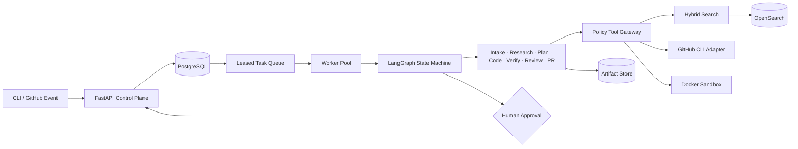

# Repo Maintenance Agent

A policy-controlled, multi-agent system that turns GitHub issues into evidence-backed patches and reviewable draft pull requests.

The control plane is Python. Repository code is treated as untrusted input and executes through language-independent Docker sandbox profiles. Every task, search query, artifact, queue lease, and tool call is scoped by tenant, repository, and immutable commit.

## Architecture



The authoritative design and interview narrative live in [Repo_Maintenance_Agent_Design.md](Repo_Maintenance_Agent_Design.md). The code-level view is in [docs/architecture.md](docs/architecture.md), and security boundaries are in [docs/threat-model.md](docs/threat-model.md).

## Engineering Guarantees

- Strict Pydantic state and legal lifecycle transitions
- Tenant/repository/commit-scoped persistence and retrieval
- PostgreSQL optimistic concurrency and atomic task enqueue
- Worker leases with fencing tokens, heartbeat renewal, retry backoff, and dead letters
- Hybrid lexical/semantic retrieval with deterministic reciprocal-rank fusion
- Deny-by-default agent permissions and plan-bound remote writes
- Argument-array process execution with executable and environment allowlists
- Patch preflight with declared-file enforcement before `git apply`
- Non-root, read-only, capability-dropped sandboxing with offline test/lint phases
- Structured OpenAI Responses with `store=False`
- Privacy-safe tracing, repository and history scanning, and an 80% coverage gate

## Repository Layout

```text
src/repo_maintenance_agent/
  agents/          structured agent nodes and output schemas
  api/             authenticated FastAPI control plane
  domain/          framework-independent state, errors, and ports
  evaluation/      deterministic benchmark graders
  graph/           LangGraph construction and routing
  models/          model-provider gateway
  observability/   redacted traces and metrics
  policies/        authorization and recursive redaction
  sandbox/         environment profiles and Docker verification
  search/          routing, OpenSearch/local adapters, and RRF
  security/        privacy and credential scanner
  storage/         task state, queue leases, and artifacts
  tools/           Git, GitHub CLI, Context7, patch, and process adapters
  worker.py        leased worker execution and retry control
configs/           versionable agent, tool, policy, and evaluation settings
sandbox/           immutable worker image and optional seccomp profile
tests/             unit and integration contracts
```

## Local Development

Python 3.12, Git, and Docker are required. Docker must be running for sandbox or image checks.

```powershell
python -m venv .venv
.venv\Scripts\python.exe -m pip install -e ".[dev,postgres,observability]"
.venv\Scripts\python.exe -m pytest --cov --cov-report=term-missing
.venv\Scripts\ruff.exe check src tests
.venv\Scripts\python.exe -m mypy src
```

The API reads secrets only from the process environment. Do not create a repository `.env` containing real credentials.

```powershell
$env:REPO_AGENT_API_TOKENS='{"local-api-token":{"tenant_id":"tenant-local","subject":"local-reviewer"}}'
$env:REPO_AGENT_ENVIRONMENT='development'
.venv\Scripts\python.exe -m uvicorn repo_maintenance_agent.main:build_application --factory
```

Open `http://127.0.0.1:8000/docs` in development. Production mode disables OpenAPI and interactive docs.

## CLI

Set the control-plane token in the process environment. The CLI never prints it.

```powershell
$env:REPO_AGENT_API_TOKEN='local-api-token'
repo-agent run owner/repository aaaaaaaaaaaaaaaaaaaaaaaaaaaaaaaaaaaaaaaa "Fix empty config"
repo-agent status TASK_ID
repo-agent approve TASK_ID PLAN_HASH --reason "Reviewed scoped files and checks"
repo-agent resume TASK_ID PLAN_HASH --reason "Approved for sandbox execution"
repo-agent cancel TASK_ID
repo-agent evaluate case.json result.json
```

`approve --reject` records a rejection and terminates the task. Approval is bound to the exact SHA-256 plan hash, so stale plans cannot be authorized.

## Configuration

| Variable | Purpose | Secret |
|---|---|---|
| `OPENAI_API_KEY` | Live model calls | yes |
| `OPENAI_MODEL` | Model selected by the model gateway | no |
| `REPO_AGENT_API_TOKENS` | JSON map of API token to tenant/subject identity | yes |
| `REPO_AGENT_API_TOKEN` | CLI bearer token | yes |
| `REPO_AGENT_API_URL` | CLI control-plane URL | no |
| `REPO_AGENT_DATABASE_URL` | SQLAlchemy database URL | usually |
| `REPO_AGENT_ARTIFACT_ROOT` | File artifact root | no |
| `REPO_AGENT_ALLOWED_HOSTS` | Trusted host allowlist | no |
| `REPO_AGENT_MAX_ITERATIONS` | Coding/review retry budget | no |

`.env.example` contains names and blank placeholders only. Production credentials belong in a secret manager and should use short-lived GitHub App installation tokens.

## Local Services

The Compose stack binds API and OpenSearch to loopback. OpenSearch security is intentionally disabled only for this local profile.

```powershell
$env:POSTGRES_PASSWORD='choose-a-local-password'
$env:REPO_AGENT_API_TOKENS='{"local-api-token":{"tenant_id":"tenant-local","subject":"local-reviewer"}}'
docker compose config
docker compose up --build
```

Images and GitHub Actions are pinned by immutable digest/SHA. The application container runs as UID 10001 with a read-only filesystem, dropped capabilities, and `no-new-privileges`. Sandbox dependency setup is a separate auditable phase; test and lint phases run with networking disabled.

## Evaluation

Evaluation separates executable correctness from model preference:

- hidden tests and regression status determine issue resolution
- Recall@10 and MRR measure relevant-file retrieval
- denied/total tool calls measure policy safety
- latency, model calls, and token usage measure efficiency

Datasets are configured in [configs/evaluation.yaml](configs/evaluation.yaml). Release gates reject unauthorized tool calls and privacy findings.

## Security

Repository text, issues, model output, and external documents are untrusted data. They cannot grant permissions. All side effects cross typed adapters and the Tool Gateway.

Run the repository scanner before publication:

```powershell
.venv\Scripts\python.exe -m repo_maintenance_agent.security.scanner
```

See [security_best_practices_report.md](security_best_practices_report.md) for the audited controls and [docs/threat-model.md](docs/threat-model.md) for abuse paths.

## License

Apache-2.0
