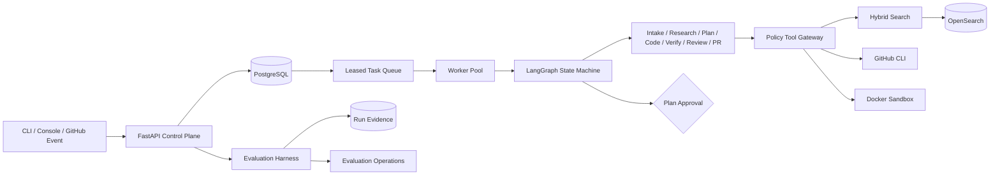

# RepoAegis

<picture>
  <source media="(prefers-color-scheme: dark)" srcset="docs/brand/repo-aegis-lockup-dark.svg">
  
</picture>

[](https://github.com/ETOLucy/RepoAegis/actions/workflows/ci.yml)
[](https://www.python.org/)
[](LICENSE)

A policy-controlled agent system that turns repository issues into evidence-backed patches,
sandbox verification, and reviewable draft pull requests.

RepoAegis is built as an AI control plane rather than a chat wrapper. Typed state,
tenant isolation, deterministic routing, tool authorization, leased workers, hybrid retrieval,
container isolation, and reproducible evaluation sit between a model decision and every side
effect.


> The screenshot shows the checked-in deterministic example suite. It demonstrates comparison,
> gate, and replay behavior; it is not a published model benchmark.

## Why This Exists

Repository maintenance agents operate on hostile input and high-impact tools. Issue text can carry
prompt injection, source trees can contain secrets, tests execute untrusted code, and remote writes
can affect production repositories. A useful system therefore needs more than an agent loop:

- immutable task scope: tenant, repository, and commit
- deny-by-default tools with stage-aware permissions
- approval-envelope-bound human approval for remote writes
- isolated execution with bounded resources and network policy
- durable concurrency control and replay-safe side effects
- evaluation that distinguishes correctness, safety, retrieval, and cost

This repository implements those boundaries end to end.

## System Map



The Python control plane owns identity, state, policy, evidence, and orchestration. Repository code
executes only in assigned workspaces or language-specific Docker sandboxes.

## Implemented Guarantees

| Boundary | Implementation |
|---|---|
| Agent state | Strict Pydantic models and legal lifecycle transitions |
| Concurrency | Atomic enqueue, optimistic versions, leased claims, rotating fencing IDs |
| Retrieval | Lexical and semantic adapters with deterministic reciprocal-rank fusion |
| Tool use | Tenant/repository/commit scope plus role and stage authorization |
| Remote writes | Human decision bound to the plan, target commit, declared files, verification commands, and exact tool scope |
| Patch safety | Declared-file enforcement and `git apply --check` preflight |
| Independent review | Gateway-collected Git diff, post-change source, acceptance criteria, and verification evidence |
| Commands | Argument arrays, executable allowlist, timeout, output limit, sanitized environment |
| Sandbox | Digest-pinned image, non-root user, read-only root, dropped capabilities, offline checks |
| Model output | Structured Responses parsing with `store=False` |
| Coding context | Gateway-only search/read requests with fixed round and tool-call ceilings |
| Evaluation | Concurrent suites, retries, provenance, baseline deltas, hard gates, deterministic replay |
| Privacy | Recursive redaction plus current-tree and reachable-history publication scanning |
| Browser surface | Same-origin console with CSP and in-memory-only bearer identity |

## Evaluation Harness

The Harness evaluates a versioned suite under a bounded concurrency limit. It preserves manifest
order, retries only timeout and infrastructure failures, and records:

- immutable repository commit and dataset version
- provider, model, prompt, tool-schema, and policy versions
- deterministic seed and normalized environment fingerprint
- observation, attempts, failure category, latency, retrieval, calls, and tokens per case
- aggregate resolution, Recall@10, MRR, regressions, safety rate, and p50/p95 latency
- candidate-minus-baseline deltas
- individual release-gate checks and one final decision

Replay creates a new run for selected cases and never mutates the source evidence.

Run the included credential-free example:

```powershell
.venv\Scripts\python.exe -m repo_maintenance_agent.cli evaluate-suite `
  examples/evaluation/suite.json `
  examples/evaluation/observations.json `
  --json-report artifacts/evaluation/example.json `
  --markdown-report artifacts/evaluation/example.md `
  --candidate-label local-example
```

The command writes both reports before returning exit code `1` for a failed gate, which makes it
usable as a CI release check.

## Web Workbench (AI Full-Stack)

A React + Vite workbench that talks to the control plane and a RAG chat endpoint:

- **代码问答 (RAG)** `POST /v1/chat`: hybrid BM25 + symbol retrieval over the repo, cited
  answers via an OpenAI-compatible model (deepseek), reference paths/line ranges returned.
- **任务控制台** `/v1/tasks`: list/create/inspect repository maintenance tasks.
- **评测看板** `/v1/evaluations/runs`: evaluation runs and release gates.

Build the frontend and serve it:

```powershell
cd web
npm --registry=https://registry.npmmirror.com install
npm run build          # outputs web/dist
```

Set `REPO_AGENT_CHAT_REPO_ROOT` to a repo checkout to enable RAG chat. The chat engine is
`repo_maintenance_agent/chat.py`; retrieval lives in `search/index.py` (BM25/symbol/vector)
and `search/embeddings.py`.

## Quick Start

Requirements:

- Python 3.12
- Git
- Docker for sandbox and image execution

```powershell
python -m venv .venv
.venv\Scripts\python.exe -m pip install -e ".[dev,postgres,observability]"
.venv\Scripts\python.exe -m pytest --cov=repo_maintenance_agent --cov-report=term-missing
.venv\Scripts\python.exe -m ruff check src tests
.venv\Scripts\python.exe -m mypy src
```

Start the local API with a development-only identity:

```powershell
$env:REPO_AGENT_API_TOKENS='{"local-api-token":{"tenant_id":"tenant-local","subject":"local-reviewer"}}'
$env:REPO_AGENT_ENVIRONMENT='development'
.venv\Scripts\python.exe -m uvicorn repo_maintenance_agent.main:build_application --factory
```

Open:

- Operations console: `http://127.0.0.1:8000/console`
- OpenAPI: `http://127.0.0.1:8000/docs`
- Health check: `http://127.0.0.1:8000/health`

The console requests the bearer identity after load and keeps it only in JavaScript memory. It does
not use cookies, local storage, session storage, or URL parameters.

## CLI

Set the control-plane identity only in the current process:

```powershell
$env:REPO_AGENT_API_TOKEN='local-api-token'

repo-agent run owner/repository aaaaaaaaaaaaaaaaaaaaaaaaaaaaaaaaaaaaaaaa "Fix empty config"
repo-agent status TASK_ID
repo-agent approve TASK_ID PLAN_HASH --reason "Reviewed scope and verification plan"
repo-agent resume TASK_ID PLAN_HASH --reason "Approved for sandbox execution"
repo-agent cancel TASK_ID
```

`status` returns the reviewable plan, deterministic risk and reasons, plan hash, evidence summaries,
declared files, verification plan, and allowed tools. `approve` reads that envelope and submits its
target commit and tool scope with the decision. The API rejects stale hashes, commits, or tool sets;
any changed envelope requires a new decision. `approve --reject` records a rejection.

## API Surface

Authenticated task routes:

```text
POST /v1/tasks
GET  /v1/tasks
GET  /v1/tasks/{task_id}
POST /v1/tasks/{task_id}/approval
POST /v1/tasks/{task_id}/cancel
```

Task responses deliberately omit tenant identity and full retrieved content. Evidence summaries
contain only source, locator, and bounded summary fields needed for review.

Authenticated evaluation routes:

```text
POST /v1/evaluations/runs
GET  /v1/evaluations/runs
GET  /v1/evaluations/runs/{run_id}
POST /v1/evaluations/runs/{run_id}/replay
GET  /v1/evaluations/runs/{run_id}/report.json
GET  /v1/evaluations/runs/{run_id}/report.md
```

Cross-tenant and unknown object IDs have the same 404 response. Public response models omit tenant
identifiers and internal queue state.

## Local Infrastructure

The Compose profile defines the API, worker, PostgreSQL, OpenSearch, authenticated sandbox runner,
and a project-owned rootless Docker daemon. The worker and daemon share no network; the runner is
the only bridge, and no Docker socket or daemon port is exposed to the host. Exposed application
ports bind to loopback. OpenSearch security is disabled only in this local profile.

```powershell
$env:POSTGRES_PASSWORD='choose-a-local-password'
$env:REPO_AGENT_API_TOKENS='{"local-api-token":{"tenant_id":"tenant-local","subject":"local-reviewer"}}'
$env:SANDBOX_RUNNER_TOKEN='choose-a-separate-runner-token'
$env:REPO_AGENT_REPOSITORY_LOCATORS='{"owner/repository":"/operator/pinned/repository.git"}'
$env:REPO_AGENT_WORKER_TENANT_IDS='["tenant-local"]'
docker compose config
docker compose up --build
```

Application and task sandbox containers run as UID 10001 with a read-only root filesystem, dropped
capabilities, `no-new-privileges`, and immutable base-image digests. The dedicated rootless daemon
is isolated from worker and host sockets. Sandbox dependency setup is a separate auditable phase;
test and lint phases run without network access. Compose syntax and isolation topology are tested;
a live Docker startup remains under validation on the current development machine.

## Configuration

| Variable | Purpose | Secret |
|---|---|---|
| `OPENAI_API_KEY` | Optional live OpenAI model calls | yes |
| `OPENAI_MODEL` | Model recorded and selected by the model gateway | no |
| `REPO_AGENT_API_TOKENS` | API bearer identities mapped to tenant and subject | yes |
| `REPO_AGENT_API_TOKEN` | CLI bearer identity | yes |
| `REPO_AGENT_API_URL` | CLI control-plane URL | no |
| `REPO_AGENT_DATABASE_URL` | SQLAlchemy task and evaluation database | usually |
| `REPO_AGENT_ARTIFACT_ROOT` | Artifact storage root | no |
| `REPO_AGENT_WORKSPACE_ROOT` | Operator-owned task workspace root | no |
| `REPO_AGENT_REPOSITORY_LOCATORS` | Allowlisted repository source registry | usually |
| `REPO_AGENT_WORKER_TENANT_IDS` | Explicit worker tenant scope | no |
| `REPO_AGENT_SANDBOX_RUNNER_TOKEN` | Worker-to-runner bearer credential | yes |
| `REPO_AGENT_ALLOWED_HOSTS` | Trusted Host allowlist | no |
| `REPO_AGENT_MAX_ITERATIONS` | Bounded graph correction budget | no |

The application never loads a repository `.env` file. `.env.example` contains names and blank
placeholders only. Production credentials belong in a secret manager; GitHub access should use
short-lived App installation tokens.

## Security Model

Issue text, repository files, model output, search results, test logs, and documentation are
untrusted data. None can grant permissions. Every side effect crosses a typed adapter and the Tool
Gateway.

Publication gate:

```powershell
.venv\Scripts\python.exe -m repo_maintenance_agent.security.scanner
```

The scanner checks tracked and non-ignored files plus all reachable Git history for credential
shapes, private keys, personal Windows paths, and private proxy configuration.

See [the threat model](docs/threat-model.md) and
[security review](security_best_practices_report.md) for deployment requirements and abuse paths.

## Repository Layout

```text
src/repo_maintenance_agent/
  agents/          typed specialist nodes and outputs
  api/             authenticated control-plane and console routes
  console/         zero-build operations workspace
  domain/          framework-independent state and ports
  evaluation/      harness, aggregation, gates, reports, and persistence
  graph/           LangGraph construction and deterministic routing
  models/          model-provider boundary
  observability/   redacted traces and normalized metrics
  policies/        tool authorization and recursive redaction
  sandbox/         language profiles and Docker verification
  search/          routing, adapters, and rank fusion
  security/        privacy and credential scanner
  storage/         task state, queue leases, and artifacts
  tools/           Git, GitHub, Context7, patch, and process adapters
examples/          credential-free evaluation inputs
sandbox/           immutable worker image and seccomp profile
tests/             unit and integration contracts
```

## Documentation

- [Authoritative system design](RepoAegis_Design.md)
- [Executable architecture map](docs/architecture.md)
- [Threat model](docs/threat-model.md)
- [Security best-practices report](security_best_practices_report.md)

## License

Apache License 2.0. See [LICENSE](LICENSE).
