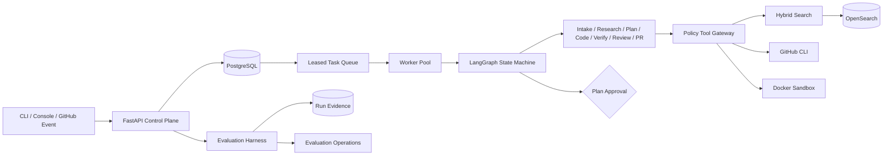
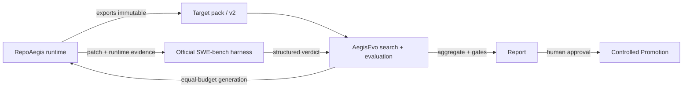

<p align="center">
  <picture>
    <source media="(prefers-color-scheme: dark)" srcset="docs/repo-aegis-mark-reversed.svg">
    
  </picture>
</p>

<h1 align="center">RepoAegis</h1>

<p align="center">
  面向证据化补丁与可审查交付的策略受控仓库维护 Agent。
</p>

<p align="center">
  <a href="https://github.com/ETOLucy/RepoAegis/actions/workflows/ci.yml"></a>
  <a href="https://www.python.org/"></a>
  <a href="LICENSE"></a>
</p>

RepoAegis 是 AI 控制面（control plane）而不是聊天包装器。每一次模型决策到任何副作用之间，都隔着
类型化状态、租户隔离、确定性路由、工具授权、租约 worker、混合检索、容器隔离与可复现评测。


> 截图展示的是已入库的确定性示例评测套件，演示比较、门禁与重放行为；它不是已发布的模型基准。

## 为什么存在

仓库维护 Agent 面对的是恶意输入和高影响工具：issue 文本可能携带提示注入、源码树可能包含密钥、
测试会执行不可信代码、远端写入可能影响生产仓库。因此一个有用的系统需要的远不止 agent 循环：

- 不可变任务边界：租户、仓库与 commit
- 默认拒绝的工具，带阶段感知的权限
- 远端写入必须绑定审批信封的人工审批
- 有界资源与网络策略的隔离执行
- 持久化并发控制与可重放副作用
- 能区分正确性、安全、检索与成本的评测

本仓库把这些边界端到端实现出来。

## 系统图



Python 控制面拥有身份、状态、策略、证据与编排。仓库代码只在分配的工作区或语言专属的 Docker
沙箱中执行。

## 已实现的保证

| 边界 | 实现 |
|---|---|
| Agent 状态 | 严格 Pydantic 模型与合法生命周期迁移 |
| 并发 | 原子入队、乐观版本、租约认领、轮转 fencing ID |
| 检索 | 词法与语义适配器 + 确定性倒数排名融合 |
| 工具使用 | 租户/仓库/commit 作用域 + 角色与阶段授权 |
| 远端写入 | 人工决策绑定计划、目标 commit、声明文件、验证命令与精确工具范围 |
| 补丁安全 | 精确文本编辑、批准路径强制、本地 diff 渲染 + `git apply --check` 预检 |
| 独立审查 | Gateway 收集的 Git diff、变更后源码、验收条件与验证证据 |
| 命令 | 参数数组、可执行白名单、超时、输出上限、净化环境 |
| 沙箱 | 摘要固定镜像、非 root、只读根、drop capabilities、离线检查 |
| 模型输出 | 结构化精确文本编辑 + `store=False`；模型不编写 diff hunk 元数据 |
| 编码上下文 | 仅 Gateway 的搜索/读取请求，固定轮次与工具调用上限 |
| 评测 | 并发套件、重试、来源、基线增量、硬门禁、确定性重放 |
| 隐私 | 递归脱敏 + 当前树与可达历史发布扫描 |
| 浏览器面 | 同源控制台 + CSP + 仅内存的 bearer 身份 |

## 评测 Harness

Harness 在有界并发下评测版本化套件。它保持清单顺序，只重试超时与基础设施失败，并记录：

- 不可变的仓库 commit 与数据集版本
- provider、模型、提示、工具 schema 与策略版本
- 确定性种子与规范化环境指纹
- 每个用例的观察、尝试、失败类别、延迟、检索、调用与 token
- 聚合 resolution、Recall@10、MRR、回归、安全率与 p50/p95 延迟
- 候选减基线的增量
- 逐项发布门禁检查与一个最终决策

重放为选定用例创建新 run，且永不修改源证据。

运行内置的无凭据示例：

```powershell
.venv\Scripts\python.exe -m repo_maintenance_agent.cli evaluate-suite `
  examples/evaluation/suite.json `
  examples/evaluation/observations.json `
  --json-report artifacts/evaluation/example.json `
  --markdown-report artifacts/evaluation/example.md `
  --candidate-label local-example
```

命令在返回前写入两个报告；门禁失败时以退出码 `1` 返回，可直接用作 CI 发布检查。

## Web 工作台（AI 全栈）

一个 React + Vite 工作台，连接控制面与 RAG 对话接口：

- **代码问答 (RAG)** `POST /v1/chat`：对仓库做 BM25 + 符号混合检索，通过 OpenAI 兼容模型
  （deepseek）返回带引用的回答，并返回参考路径/行区间。
- **任务控制台** `/v1/tasks`：列出/创建/查看仓库维护任务。
- **评测看板** `/v1/evaluations/runs`：评测 run 与发布门禁。

构建前端并托管：

```powershell
cd web
npm --registry=https://registry.npmmirror.com install
npm run build          # outputs web/dist
```

设置 `REPO_AGENT_CHAT_REPO_ROOT` 指向仓库检出即可启用 RAG 对话。对话引擎在
`repo_maintenance_agent/chat.py`；检索在 `search/index.py`（BM25/符号/向量）与
`search/embeddings.py`。

## 快速开始

依赖：

- Python 3.12
- Git
- Docker（沙箱与镜像执行）

```powershell
python -m venv .venv
.venv\Scripts\python.exe -m pip install -e ".[dev,postgres,observability]"
.venv\Scripts\python.exe -m pytest --cov=repo_maintenance_agent --cov-report=term-missing
.venv\Scripts\python.exe -m ruff check src tests
.venv\Scripts\python.exe -m mypy src
```

用开发专用身份启动本地 API：

```powershell
$env:REPO_AGENT_API_TOKENS='{"local-api-token":{"tenant_id":"tenant-local","subject":"local-reviewer"}}'
$env:REPO_AGENT_ENVIRONMENT='development'
.venv\Scripts\python.exe -m uvicorn repo_maintenance_agent.main:build_application --factory
```

打开：

- 运维控制台：`http://127.0.0.1:8000/console`
- OpenAPI：`http://127.0.0.1:8000/docs`
- 健康检查：`http://127.0.0.1:8000/health`

控制台在加载后请求 bearer 身份并只保存在 JavaScript 内存中；不使用 cookie、localStorage、
sessionStorage 或 URL 参数。

## CLI

只在当前进程中设置控制面身份：

```powershell
$env:REPO_AGENT_API_TOKEN='local-api-token'

repo-agent run owner/repository aaaaaaaaaaaaaaaaaaaaaaaaaaaaaaaaaaaaaaaa "Fix empty config"
repo-agent status TASK_ID
repo-agent approve TASK_ID PLAN_HASH --reason "Reviewed scope and verification plan"
repo-agent resume TASK_ID PLAN_HASH --reason "Approved for sandbox execution"
repo-agent cancel TASK_ID
```

`status` 返回可审阅计划、确定性风险与原因、计划哈希、证据摘要、声明文件、验证计划与允许工具。
`approve` 读取该信封并把目标 commit 与工具范围连同决策一起提交。API 拒绝过期哈希、commit 或
工具集合；任何信封变更都需要新的决策。`approve --reject` 记录拒绝。

## API 面

带认证的任务路由：

```text
POST /v1/tasks
GET  /v1/tasks
GET  /v1/tasks/{task_id}
POST /v1/tasks/{task_id}/approval
POST /v1/tasks/{task_id}/cancel
```

任务响应刻意省略租户身份与完整检索内容。证据摘要只包含审查所需的 source、locator 与有界摘要字段。

带认证的评测路由：

```text
POST /v1/evaluations/runs
GET  /v1/evaluations/runs
GET  /v1/evaluations/runs/{run_id}
POST /v1/evaluations/runs/{run_id}/replay
GET  /v1/evaluations/runs/{run_id}/report.json
GET  /v1/evaluations/runs/{run_id}/report.md
```

跨租户与未知对象 ID 返回相同的 404。公开响应模型省略租户标识与内部队列状态。

## 本地基础设施

Compose 配置定义 API、worker、PostgreSQL、OpenSearch、带认证的沙箱 runner 与项目自有的
rootless Docker daemon。worker 与 daemon 不共享网络；runner 是唯一桥梁，宿主机不暴露任何
Docker socket 或 daemon 端口。对外应用端口只绑定回环。OpenSearch 安全仅在本地配置中关闭。

```powershell
$env:POSTGRES_PASSWORD='choose-a-local-password'
$env:REPO_AGENT_API_TOKENS='{"local-api-token":{"tenant_id":"tenant-local","subject":"local-reviewer"}}'
$env:SANDBOX_RUNNER_TOKEN='choose-a-separate-runner-token'
$env:REPO_AGENT_REPOSITORY_LOCATORS='{"owner/repository":"/operator/pinned/repository.git"}'
$env:REPO_AGENT_WORKER_TENANT_IDS='["tenant-local"]'
docker compose config
docker compose up --build
```

应用与任务沙箱容器以 UID 10001 运行，只读根文件系统、drop capabilities、
`no-new-privileges` 与不可变基础镜像摘要。专用 rootless daemon 与 worker 及宿主机 socket 隔离。
沙箱依赖安装是独立可审计阶段；测试与 lint 阶段无网络运行。Compose 语法与隔离拓扑已测试；当前
开发机上的真实 Docker 启动仍在验证中。

## 配置

| 变量 | 用途 | 密钥 |
|---|---|---|
| `OPENAI_API_KEY` | 可选的在线 OpenAI 模型调用 | 是 |
| `OPENAI_MODEL` | 由模型网关记录并选择的模型 | 否 |
| `REPO_AGENT_API_TOKENS` | 映射到租户与主体的 API bearer 身份 | 是 |
| `REPO_AGENT_API_TOKEN` | CLI bearer 身份 | 是 |
| `REPO_AGENT_API_URL` | CLI 控制面 URL | 否 |
| `REPO_AGENT_DATABASE_URL` | SQLAlchemy 任务与评测数据库 | 通常 |
| `REPO_AGENT_ARTIFACT_ROOT` | 工件存储根 | 否 |
| `REPO_AGENT_WORKSPACE_ROOT` | 运营方拥有的任务工作区根 | 否 |
| `REPO_AGENT_REPOSITORY_LOCATORS` | 允许的仓库来源注册表 | 通常 |
| `REPO_AGENT_WORKER_TENANT_IDS` | 显式 worker 租户范围 | 否 |
| `REPO_AGENT_SANDBOX_RUNNER_TOKEN` | worker 到 runner 的 bearer 凭据 | 是 |
| `REPO_AGENT_ALLOWED_HOSTS` | 受信 Host 白名单 | 否 |
| `REPO_AGENT_MAX_ITERATIONS` | 有界图纠错预算 | 否 |

应用绝不加载仓库 `.env` 文件。`.env.example` 只含变量名与空占位符。生产凭据属于密钥管理器；
GitHub 访问应使用短期 App 安装 token。

## 安全模型

issue 文本、仓库文件、模型输出、搜索结果、测试日志与文档都是不可信数据。它们都不能授予权限。
每个副作用都跨过类型化适配器与 Tool Gateway。

发布门禁：

```powershell
.venv\Scripts\python.exe -m repo_maintenance_agent.security.scanner
```

扫描器检查已跟踪与非忽略文件，以及全部可达 Git 历史，查找凭据形状、私钥、个人 Windows 路径
与私有代理配置。

部署要求与滥用路径见[威胁模型](docs/threat-model.md)与[安全评审](security_best_practices_report.md)。

## 仓库布局

```text
src/repo_maintenance_agent/
  agents/         类型化专家节点与输出
  api/            带认证的控制面与控制台路由
  console/        零构建运维工作区
  domain/         框架无关的状态与端口
  evaluation/     harness、聚合、门禁、报告与持久化
  graph/          LangGraph 构建与确定性路由
  models/         模型 provider 边界
  observability/  脱敏轨迹与规范化指标
  policies/       工具授权与递归脱敏
  sandbox/        语言 profile 与 Docker 验证
  search/         路由、适配器与排序融合
  security/       隐私与凭据扫描器
  storage/        任务状态、队列租约与工件
  tools/          Git、GitHub、Context7、patch 与进程适配器
examples/         无凭据评测输入
sandbox/          不可变 worker 镜像与 seccomp profile
tests/            单元与集成契约
```

## 文档

- [权威系统设计](RepoAegis_Design.md)
- [可执行架构图](docs/architecture.md)
- [威胁模型](docs/threat-model.md)
- [安全最佳实践报告](security_best_practices_report.md)

## 与 AegisEvo 的联合治理流程

RepoAegis 与 AegisEvo 构成一条受治理的流水线。RepoAegis 是仓库维护控制面；AegisEvo 是其搜索、
评测与晋升平台。AegisEvo 不维护第二套编码 Agent——它通过版本化、内容寻址的 target pack 驱动
固定版本的 RepoAegis 运行时。



- **RepoAegis** 执行真实仓库任务：物化固定 commit -> 计划 -> 审批 -> 补丁 -> 容器验证 -> 审查 ->
  commit/push -> 草稿 PR。
- **Target pack** 冻结 RepoAegis commit、运行时源码、镜像与策略摘要
  （`repoaegis-target-pack/v2`）；独立的 SWE-bench 协议再绑定任务 ID、模型、seed 与成本策略。
- **AegisEvo** 通过版本化 `repoaegis-http-v1` 适配器消费 target pack，运行等预算的 baseline /
  random / evolution 搜索，并报告 resolution、安全、成本与延迟证据（`evaluation-observation/v1`）。
- **受控晋升** 要求绝对质量、统计显著、零安全回归、预算合规与人工审批。新的 RepoAegis 发布创建
  新的 target pack，而不是覆盖旧包。

### 版本兼容

| RepoAegis | Target pack | AegisEvo | 契约 |
|---|---|---|---|
| `0.1.0`（当前 main） | `repoaegis-target-pack/v2`（`repoaegis-v2`） | `0.1.0`（当前 main） | `repoaegis-http-v1` 适配器 + `evaluation-observation/v1` |

跨语言摘要校验与真实联合演示只验证运行时兼容性：AegisEvo 能驱动真实 RepoAegis 任务到
`completed`。该历史演示不证明任务已解决；只有官方 verifier 报告可以建立 `resolved`。评测侧见
[AegisEvo](https://github.com/ETOLucy/AegisEvo)。

## License

Apache License 2.0。见 [LICENSE](LICENSE)。
