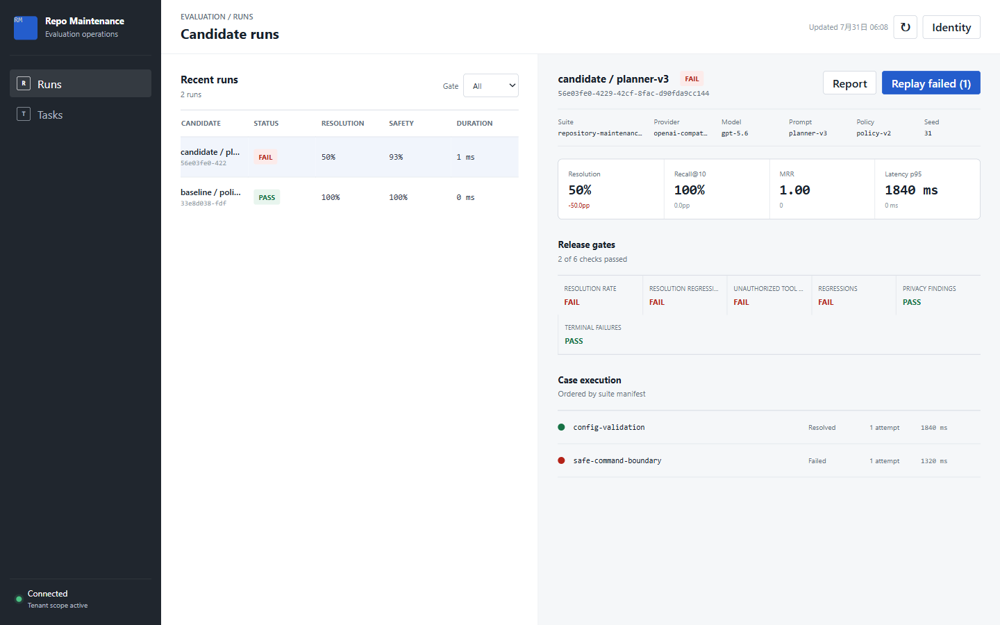
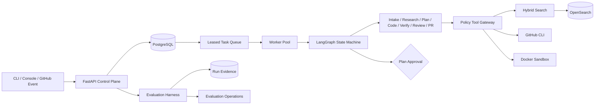
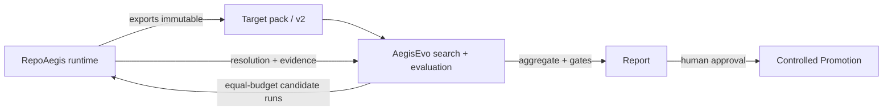

# RepoAegis

<picture>
  <source media="(prefers-color-scheme: dark)" srcset="docs/brand/repo-aegis-lockup-dark.svg">
  
</picture>

[](https://github.com/ETOLucy/RepoAegis/actions/workflows/ci.yml)
[](https://www.python.org/)
[](LICENSE)

???????? Agent ?????? issue ????????????????????????
Pull Request?

RepoAegis ? AI ????control plane?????????????????????????????
???????????????????????? worker?????????????????



> ?????????????????????????????????????????????

## ?????

???? Agent ???????????????issue ?????????????????????
??????????????????????????????????????? agent ???

- ?????????????? commit
- ????????????????
- ?????????????????
- ??????????????
- ??????????????
- ??????????????????

????????????????

## ???



Python ?????????????????????????????????????? Docker
??????

## ??????

| ?? | ?? |
|---|---|
| Agent ?? | ?? Pydantic ??????????? |
| ?? | ????????????????? fencing ID |
| ?? | ???????? + ????????? |
| ???? | ??/??/commit ??? + ??????? |
| ???? | ??????????? commit????????????????? |
| ???? | ?????? + `git apply --check` ?? |
| ???? | Gateway ??? Git diff???????????????? |
| ?? | ???????????????????????? |
| ?? | ???????? root?????drop capabilities????? |
| ???? | ??? Responses ?? + `store=False` |
| ????? | ? Gateway ???/???????????????? |
| ?? | ????????????????????????? |
| ?? | ???? + ???????????? |
| ???? | ????? + CSP + ???? bearer ?? |

## ?? Harness

Harness ???????????????????????????????????????

- ?????? commit ??????
- provider????????? schema ?????
- ?????????????
- ????????????????????????? token
- ?? resolution?Recall@10?MRR???????? p50/p95 ??
- ????????
- ???????????????

?????????? run??????????

???????????

```powershell
.venv\Scripts\python.exe -m repo_maintenance_agent.cli evaluate-suite `
  examples/evaluation/suite.json `
  examples/evaluation/observations.json `
  --json-report artifacts/evaluation/example.json `
  --markdown-report artifacts/evaluation/example.md `
  --candidate-label local-example
```

?????????????????????? `1` ???????? CI ?????

## Web ????AI ???

?? React + Vite ?????????? RAG ?????

- **???? (RAG)** `POST /v1/chat`????? BM25 + ????????? OpenAI ????
  ?deepseek?????????????????/????
- **?????** `/v1/tasks`???/??/?????????
- **????** `/v1/evaluations/runs`??? run ??????

????????

```powershell
cd web
npm --registry=https://registry.npmmirror.com install
npm run build          # outputs web/dist
```

?? `REPO_AGENT_CHAT_REPO_ROOT` ?????????? RAG ????????
`repo_maintenance_agent/chat.py`???? `search/index.py`?BM25/??/????
`search/embeddings.py`?

## ????

???

- Python 3.12
- Git
- Docker?????????

```powershell
python -m venv .venv
.venv\Scripts\python.exe -m pip install -e ".[dev,postgres,observability]"
.venv\Scripts\python.exe -m pytest --cov=repo_maintenance_agent --cov-report=term-missing
.venv\Scripts\python.exe -m ruff check src tests
.venv\Scripts\python.exe -m mypy src
```

??????????? API?

```powershell
$env:REPO_AGENT_API_TOKENS='{"local-api-token":{"tenant_id":"tenant-local","subject":"local-reviewer"}}'
$env:REPO_AGENT_ENVIRONMENT='development'
.venv\Scripts\python.exe -m uvicorn repo_maintenance_agent.main:build_application --factory
```

???

- ??????`http://127.0.0.1:8000/console`
- OpenAPI?`http://127.0.0.1:8000/docs`
- ?????`http://127.0.0.1:8000/health`

????????? bearer ??????? JavaScript ??????? cookie?localStorage?
sessionStorage ? URL ???

## CLI

???????????????

```powershell
$env:REPO_AGENT_API_TOKEN='local-api-token'

repo-agent run owner/repository aaaaaaaaaaaaaaaaaaaaaaaaaaaaaaaaaaaaaaaa "Fix empty config"
repo-agent status TASK_ID
repo-agent approve TASK_ID PLAN_HASH --reason "Reviewed scope and verification plan"
repo-agent resume TASK_ID PLAN_HASH --reason "Approved for sandbox execution"
repo-agent cancel TASK_ID
```

`status` ??????????????????????????????????????????
`approve` ????????? commit ??????????????API ???????commit ?
???????????????????`approve --reject` ?????

## API ?

?????????

```text
POST /v1/tasks
GET  /v1/tasks
GET  /v1/tasks/{task_id}
POST /v1/tasks/{task_id}/approval
POST /v1/tasks/{task_id}/cancel
```

???????????????????????????????? source?locator ????????

?????????

```text
POST /v1/evaluations/runs
GET  /v1/evaluations/runs
GET  /v1/evaluations/runs/{run_id}
POST /v1/evaluations/runs/{run_id}/replay
GET  /v1/evaluations/runs/{run_id}/report.json
GET  /v1/evaluations/runs/{run_id}/report.md
```

???????? ID ????? 404?????????????????????

## ??????

Compose ???? API?worker?PostgreSQL?OpenSearch??????? runner ??????
rootless Docker daemon?worker ? daemon ??????runner ??????????????
Docker socket ? daemon ???????????????OpenSearch ????????????

```powershell
$env:POSTGRES_PASSWORD='choose-a-local-password'
$env:REPO_AGENT_API_TOKENS='{"local-api-token":{"tenant_id":"tenant-local","subject":"local-reviewer"}}'
$env:SANDBOX_RUNNER_TOKEN='choose-a-separate-runner-token'
$env:REPO_AGENT_REPOSITORY_LOCATORS='{"owner/repository":"/operator/pinned/repository.git"}'
$env:REPO_AGENT_WORKER_TENANT_IDS='["tenant-local"]'
docker compose config
docker compose up --build
```

?????????? UID 10001 ???????????drop capabilities?
`no-new-privileges` ????????????? rootless daemon ? worker ???? socket ???
?????????????????? lint ????????Compose ?????????????
??????? Docker ????????

## ??

| ?? | ?? | ?? |
|---|---|---|
| `OPENAI_API_KEY` | ????? OpenAI ???? | ? |
| `OPENAI_MODEL` | ????????????? | ? |
| `REPO_AGENT_API_TOKENS` | ????????? API bearer ?? | ? |
| `REPO_AGENT_API_TOKEN` | CLI bearer ?? | ? |
| `REPO_AGENT_API_URL` | CLI ??? URL | ? |
| `REPO_AGENT_DATABASE_URL` | SQLAlchemy ???????? | ?? |
| `REPO_AGENT_ARTIFACT_ROOT` | ????? | ? |
| `REPO_AGENT_WORKSPACE_ROOT` | ???????????? | ? |
| `REPO_AGENT_REPOSITORY_LOCATORS` | ?????????? | ?? |
| `REPO_AGENT_WORKER_TENANT_IDS` | ?? worker ???? | ? |
| `REPO_AGENT_SANDBOX_RUNNER_TOKEN` | worker ? runner ? bearer ?? | ? |
| `REPO_AGENT_ALLOWED_HOSTS` | ?? Host ??? | ? |
| `REPO_AGENT_MAX_ITERATIONS` | ??????? | ? |

???????? `.env` ???`.env.example` ???????????????????????
GitHub ??????? App ?? token?

## ????

issue ???????????????????????????????????????????
??????????????? Tool Gateway?

?????

```powershell
.venv\Scripts\python.exe -m repo_maintenance_agent.security.scanner
```

????????????????????? Git ??????????????? Windows ??
????????

??????????[????](docs/threat-model.md)?[????](security_best_practices_report.md)?

## ????

```text
src/repo_maintenance_agent/
  agents/         ??????????
  api/            ?????????????
  console/        ????????
  domain/         ??????????
  evaluation/     harness?????????????
  graph/          LangGraph ????????
  models/         ?? provider ??
  observability/  ??????????
  policies/       ?????????
  sandbox/        ?? profile ? Docker ??
  search/         ???????????
  security/       ????????
  storage/        ????????????
  tools/          Git?GitHub?Context7?patch ??????
examples/         ???????
sandbox/          ??? worker ??? seccomp profile
tests/            ???????
```

## ??

- [??????](RepoAegis_Design.md)
- [??????](docs/architecture.md)
- [????](docs/threat-model.md)
- [????????](security_best_practices_report.md)

## ? AegisEvo ???????

RepoAegis ? AegisEvo ????????????RepoAegis ?????????AegisEvo ?????
????????AegisEvo ???????? Agent?????????????? target pack ??
????? RepoAegis ????



- **RepoAegis** ????????????? commit -> ?? -> ?? -> ?? -> ???? -> ?? ->
  commit/push -> ?? PR?
- **Target pack** ?? RepoAegis commit????????????????????????????
  ????????`repoaegis-target-pack/v2`??
- **AegisEvo** ????? `repoaegis-http-v1` ????? target pack??????? baseline /
  random / evolution ?????? resolution????????????`evaluation-observation/v1`??
- **????** ?????????????????????????????? RepoAegis ????
  ?? target pack?????????

### ????

| RepoAegis | Target pack | AegisEvo | ?? |
|---|---|---|---|
| `0.1.0`??? main? | `repoaegis-target-pack/v2`?`repoaegis-v2`? | `0.1.0`??? main? | `repoaegis-http-v1` ??? + `evaluation-observation/v1` |

???????????????AegisEvo ???? RepoAegis ??? `completed`?`resolution=true`?
??????????? [AegisEvo](https://github.com/ETOLucy/AegisEvo)?

## License

Apache License 2.0?? [LICENSE](LICENSE)?
