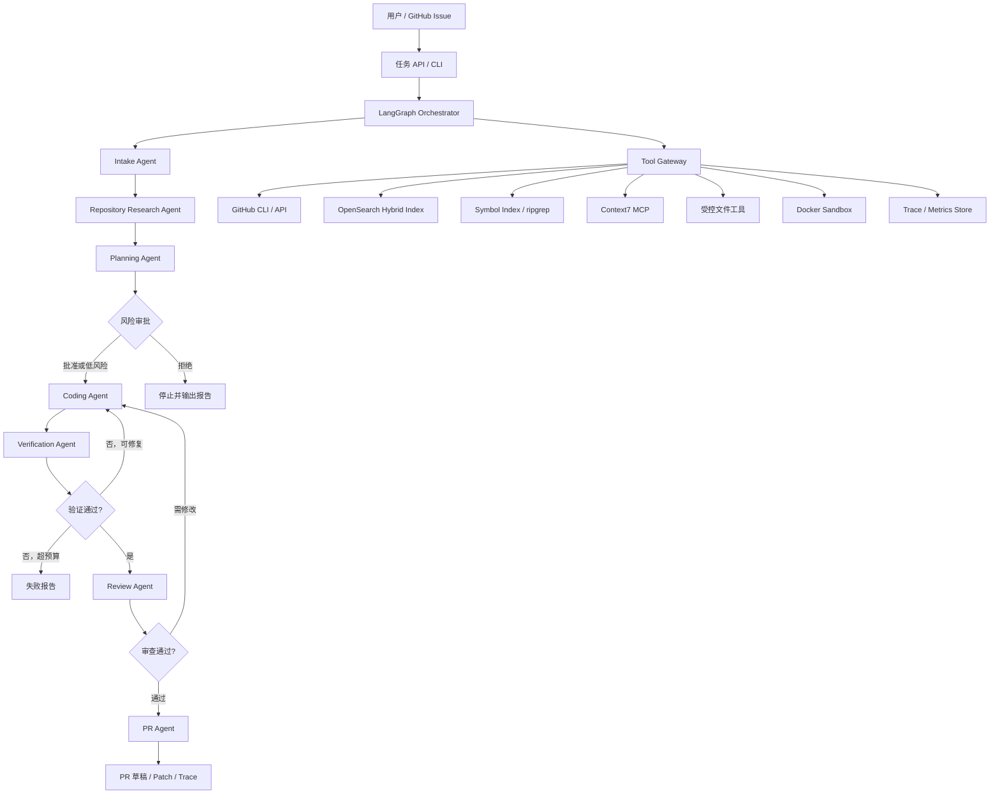
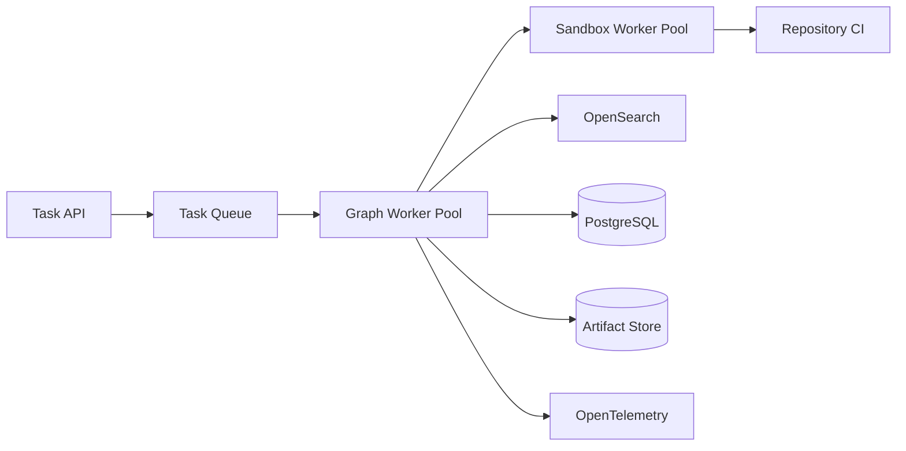

# Repo Maintenance Agent 架构设计

> 文档性质：生产级参考架构与工程实现
> 项目阶段：实现、验证与持续演进
> 核心场景：从 GitHub Issue 出发，在隔离环境中完成仓库理解、代码修改、验证，并生成可审查的 Pull Request

## 1. 项目定位

Repo Maintenance Agent 是一个面向真实软件仓库维护任务的自主 Agent 系统。它接收 GitHub Issue 或人工输入的维护任务，读取仓库上下文，定位相关代码，制定计划，在受控沙箱中修改代码并执行验证，最后输出补丁、证据和 Pull Request 草稿。

它不是普通的“代码问答 + RAG”，因为最终目标不是生成一段自然语言答案，而是完成一个可验证、可追踪、可回滚的软件工程闭环：

```text
Issue
  -> 任务理解
  -> 仓库检索
  -> 影响分析
  -> 修改计划
  -> 沙箱执行
  -> 测试与审查
  -> PR 草稿
  -> 人工批准
```

### 1.1 核心价值

- 将 Issue 转换为结构化、可执行的维护任务。
- 通过符号检索、文本检索和依赖关系分析理解陌生仓库。
- 使用多 Agent 分工降低单次长上下文推理的不稳定性。
- 通过 Docker Sandbox、最小权限和人工审批控制执行风险。
- 使用测试、静态检查和差异审查证明修改有效，而不是只声称“已经修复”。
- 记录完整轨迹，为失败复盘、离线评测和持续优化提供数据。

### 1.2 目标与非目标

目标：

- 支持缺陷修复、小型功能、测试补充、文档同步和依赖维护。
- 支持 GitHub Issue、仓库、分支、Commit、PR 和 CI 状态读取。
- 形成从任务分析到 PR 草稿的端到端闭环。
- 所有结论都能追溯到文件、命令输出、测试结果或外部文档。
- 高风险操作必须暂停并等待人工批准。

非目标：

- 不自动合并 PR。
- 不直接操作生产环境。
- 不在宿主机上执行仓库中的不可信脚本。
- 不保证一次解决大型重构、跨仓库迁移或需求不明确的任务。
- 不把 LLM 自我判断当作验证结果。

### 1.3 典型输入与输出

输入：

- GitHub 仓库地址和 Issue 编号。
- 可选的目标分支、语言、构建命令和安全策略。
- GitHub Token、模型凭据等运行时 Secret 引用。

输出：

- 结构化任务规格。
- 相关文件、符号、依赖和证据列表。
- 修改计划及风险说明。
- 可应用的 Git Diff。
- 测试、Lint、类型检查和安全检查结果。
- PR 标题、正文、关联 Issue 和验证说明。
- 完整 Agent Trace 与成本、耗时、工具调用统计。

## 2. 总体架构

系统采用“LangGraph 编排 + 专职 Agent 节点 + 统一工具网关 + Docker Sandbox”的分层架构。



### 2.1 分层职责

| 层 | 职责 | 推荐实现 |
|---|---|---|
| 接入层 | 创建任务、查询状态、人工审批 | Python + FastAPI + CLI |
| 编排层 | 状态流转、重试、条件分支、Checkpoint | Python + LangGraph |
| 推理层 | Intake、Research、Plan、Code、Verify、Review、PR | Python + 支持 Function Calling 的 LLM |
| 工具层 | GitHub、检索、文件、命令、文档工具的统一入口 | Tool Gateway |
| 执行层 | Checkout、修改、测试、构建 | Docker Sandbox |
| 数据层 | Task State、Trace、Artifact、Metrics | PostgreSQL + 对象存储 |
| 观测层 | 日志、调用链、Token、耗时、成功率 | OpenTelemetry + Dashboard |

### 2.2 为什么采用 Graph，而不是单 Agent 循环

单 Agent 的 `think -> tool -> think` 循环适合短任务，但仓库维护包含多个明确阶段、不同权限和失败分支。Graph 更适合表达：

- 哪些步骤必须按顺序执行。
- 哪些节点可以重试，最大重试次数是多少。
- 测试失败时回到 Coding，而不是重新读取整个 Issue。
- 高风险变更何时触发人工审批。
- 每个节点只读取所需状态，降低上下文污染。
- 中断后从 Checkpoint 恢复，而不是从头执行。

### 2.3 生产运行架构

生产环境将 API、编排器和执行器解耦，避免长时间构建阻塞请求线程：



- Task API 只负责创建任务、查询状态、取消任务和提交审批。
- Graph Worker 持有 LangGraph Checkpoint，通过租约和心跳防止任务重复消费。
- Sandbox Worker 按语言、资源等级和信任级别调度隔离环境。
- 按租户限制任务并发数、Token、CPU、内存和检索配额。
- 支持任务优先级、超时回收、主动取消和失败队列。
- 相同 `repo_id + commit_sha + index_schema_version` 的索引任务自动去重。
- 同一目标分支的写操作使用乐观锁，避免多个任务相互覆盖。

容量规划以峰值并发、P50/P95 任务耗时、Sandbox 启动时间、索引延迟和单位任务成本为核心指标。

### 2.4 编程语言与服务边界

系统采用 **Python Control Plane + 语言无关 Execution Plane**：

```text
Python Control Plane
├── FastAPI / CLI
├── LangGraph Orchestrator
├── Agent Nodes
├── Tool Gateway
├── Search Orchestration
├── Policy Engine
└── Evaluation

Language-independent Execution Plane
├── Docker Sandbox
├── Git / GitHub CLI
├── OpenSearch
├── PostgreSQL
└── Repository CI
```

选择 Python 的原因不是“Agent 只能用 Python”，而是控制面的主要负载为模型调用、搜索、GitHub API、状态持久化和沙箱调度，属于 I/O 密集型；Python 在 LangGraph、模型 SDK、Pydantic 结构化输出和 Evaluation 方面的生态更完整，能以更低成本完成可验证闭环。

Python 不限制被维护仓库的语言。Environment Profile 将不同技术栈映射到独立 Sandbox Image 和验证命令：

| 仓库语言 | 运行环境 | 典型验证命令 |
|---|---|---|
| Python | Python Sandbox | `pytest`、`ruff check`、`mypy` |
| JavaScript/TypeScript | Node.js Sandbox | `npm test`、`eslint`、`tsc --noEmit` |
| Java | JDK Sandbox | `mvn test` 或 `gradle test` |
| Go | Go Sandbox | `go test ./...` |
| Rust | Rust Sandbox | `cargo test`、`cargo clippy` |

只有当 Profiling 证明 Python 成为 CPU、并发或资源控制瓶颈时，才将 Sandbox Scheduler、Workspace Manager、大规模索引流水线等模块拆为 Go/Java 服务；对外协议和领域状态保持不变，避免基于偏好进行过早的多语言拆分。

## 3. Agent Graph

### 3.1 共享状态

所有节点通过显式状态传递信息，不依赖聊天历史作为唯一事实源。

```python
class RepoTaskState(TypedDict):
    task_id: str
    tenant_id: str
    repo: str
    issue_number: int | None
    base_branch: str
    task_spec: dict
    repo_profile: dict
    evidence: list[dict]
    plan: list[dict]
    changed_files: list[str]
    patch: str | None
    verification: dict
    review: dict
    approval: dict
    pr_draft: dict
    artifacts: list[dict]
    errors: list[dict]
    iteration: int
    budget: dict
```

状态设计原则：

- 节点输出使用 JSON Schema/Pydantic 校验。
- `evidence` 必须记录来源、文件路径、行号或命令。
- `errors` 追加写入，不覆盖历史错误。
- Patch、日志等大对象存入 Artifact Store，State 中只保留引用。
- 节点必须幂等；重试不能重复创建分支或 PR。
- `tenant_id` 必须贯穿 State、索引过滤、缓存键、Artifact ACL 和审计日志。
- 模型 ID、Prompt Hash、Tool Schema Version 和 Policy Version 必须进入 Trace。

### 3.2 路由规则

```text
START -> intake -> research -> plan
plan -> approval_gate
approval_gate(approved) -> code
approval_gate(rejected) -> END
code -> verify
verify(pass) -> review
verify(fail && iteration < max_iterations) -> code
verify(fail && iteration >= max_iterations) -> failure_report
review(pass) -> pr
review(change_requested && iteration < max_iterations) -> code
pr -> END
```

建议默认预算：

- 最大 Coding/Verification 循环：3 次。
- 单任务最大墙钟时间：30 分钟。
- 单命令默认超时：5 分钟。
- 单任务最大模型调用次数和 Token 成本可配置。
- 超过预算后停止执行，保留当前 Patch 和失败证据。

## 4. 每个 Agent 节点

### 4.1 Intake Agent：任务解析

职责：

- 读取 Issue 标题、正文、评论、标签和关联 PR。
- 区分缺陷、功能、文档、测试、依赖升级等任务类型。
- 提取验收标准、复现步骤、约束和不确定项。
- 检查 Issue 是否包含 Prompt Injection 或要求泄露 Secret 的内容。

输入：原始任务、Issue 数据。  
输出：`task_spec`。  
主要工具：`gh issue view`、GitHub API。  
停止条件：任务目标无法确定，且不同解释会导致明显不同的修改。

示例输出：

```yaml
task_type: bugfix
summary: 修复空配置导致的启动异常
acceptance_criteria:
  - 空配置时使用默认值
  - 原有非空配置行为不变
  - 增加回归测试
constraints:
  - 不修改公开 API
unknowns: []
```

### 4.2 Repository Research Agent：仓库理解

职责：

- 生成仓库画像：语言、框架、构建系统、测试入口、贡献规范。
- 读取 `README`、`AGENTS.md`、`CONTRIBUTING`、CI 和依赖清单。
- 使用多路检索定位入口、符号、调用方、测试和历史变更。
- 为每条判断提供证据，不直接修改代码。

输入：`task_spec`、只读仓库。  
输出：`repo_profile`、`evidence`、候选文件排序。  
主要工具：`rg`、文件树、AST/符号索引、`git log`、`git blame`、Context7。  
禁止：执行项目脚本、写文件、创建分支。

### 4.3 Planning Agent：计划与影响分析

职责：

- 将验收标准映射到代码改动和测试。
- 识别公开 API、数据库、鉴权、依赖和 CI 等高风险范围。
- 输出小步、可验证、带依赖关系的修改计划。
- 给出回滚策略和预期测试命令。

输入：`task_spec`、`repo_profile`、`evidence`。  
输出：`plan`、风险等级。  
主要工具：原则上不调用写工具，可补充只读检索。  
质量门槛：每个计划步骤都必须有目标文件、原因和验证方式。

### 4.4 Approval Gate：人工审批

以下情况必须中断 Graph：

- 修改认证、授权、支付、加密或 Secret 处理。
- 数据库 Schema 迁移或数据删除。
- 引入新依赖、修改 CI 权限或 GitHub Actions。
- 修改文件数量、行数或成本超过阈值。
- 任务需求仍有关键歧义。
- 准备创建远程分支或 PR。

审批结果写入 State，包含审批人、时间、范围和备注。

### 4.5 Coding Agent：实现修改

职责：

- 在临时分支和 Docker Sandbox 内按计划修改代码。
- 优先采用仓库已有模式，不进行无关重构。
- 同步补充或修改测试。
- 每轮记录修改目的和受影响文件。

输入：已批准的 `plan`、当前 Patch、验证反馈。  
输出：`changed_files`、`patch`、实现说明。  
主要工具：受控文件读写、Patch、Formatter、Docker 命令。  
禁止：直接 Push、读取宿主机 Secret、绕过工具网关。

### 4.6 Verification Agent：执行验证

职责：

- 按“最小相关测试 -> 模块测试 -> 全量检查”的顺序执行。
- 运行测试、Lint、Formatter check、类型检查和构建。
- 对失败进行分类：实现错误、环境错误、已有失败、超时。
- 对缺陷修复验证“修复前失败、修复后通过”，条件允许时执行 Patch 反转对照。

输入：Patch、仓库测试配置。  
输出：结构化 `verification` 和日志 Artifact。  
主要工具：Docker Sandbox、测试框架、静态分析器。  
通过标准：计划要求的检查全部通过，或明确记录并批准例外。

### 4.7 Review Agent：独立差异审查

职责：

- 只根据 Issue、验收标准、Diff 和测试证据进行独立审查。
- 检查正确性、边界条件、安全、兼容性、可维护性和无关改动。
- 尝试找出“测试通过但需求未满足”的情况。
- 输出 `approve` 或 `request_changes`，并按严重性列出发现。

输入：任务规格、Diff、验证证据。  
输出：`review`。  
主要工具：只读 Diff、搜索和静态检查。  
隔离原则：不直接复用 Coding Agent 的推理过程，减少自我确认偏差。

### 4.8 PR Agent：交付

职责：

- 生成分支名、Commit message、PR 标题和正文。
- 在正文中关联 Issue，列出修改摘要、测试证据、风险和回滚方式。
- 默认只创建 Draft PR；远程写操作前再次检查批准状态。
- 若未授权远程操作，则输出本地 Patch 和 PR 草稿。

输入：已通过审查的 Patch。  
输出：`pr_draft`、PR URL 或本地 Artifact。  
主要工具：`gh pr create`、`git` 的受限子命令。

## 5. Tool 设计

### 5.1 统一 Tool Contract

LLM 不直接拼接并执行任意 Shell，而是调用有 Schema 的工具。

```yaml
name: search_code
description: 在仓库允许范围内搜索文本或符号
input_schema:
  type: object
  required: [query]
  properties:
    query: { type: string }
    paths: { type: array, items: { type: string } }
    mode: { enum: [text, regex, symbol] }
    max_results: { type: integer, minimum: 1, maximum: 200 }
output_schema:
  type: object
  required: [matches, truncated]
  properties:
    matches: { type: array }
    truncated: { type: boolean }
```

每次工具调用统一记录：

- `task_id`、`agent`、`tool_name`、`call_id`。
- 经过脱敏的输入和输出摘要。
- 开始时间、耗时、退出码、重试次数。
- 权限决策、Artifact 地址和错误分类。

### 5.2 工具分类

| 类别 | 代表工具 | 权限 |
|---|---|---|
| GitHub 读取 | `get_issue`、`get_pr`、`get_ci_status` | 只读 |
| GitHub 写入 | `create_branch`、`create_draft_pr`、`comment_issue` | 审批后 |
| 仓库检索 | `list_files`、`search_text`、`find_symbol`、`git_history` | 只读 |
| 文件修改 | `read_file`、`apply_patch`、`format_files` | Sandbox 内 |
| 命令执行 | `run_test`、`run_lint`、`run_build` | Sandbox 内、白名单 |
| 文档查询 | `context7_resolve`、`context7_query` | 只读、外部网络 |
| 控制工具 | `request_approval`、`report_failure` | 编排层 |

### 5.3 Tool Gateway

Tool Gateway 是安全边界，不只是工具集合。它负责：

- 参数 Schema 校验和路径规范化。
- 防止 `..`、符号链接等方式逃逸工作区。
- 按 Agent、任务阶段和风险等级检查权限。
- 命令白名单、超时、输出大小和进程数限制。
- 对 Token、URL、用户信息等敏感内容脱敏。
- 统一重试；副作用工具使用幂等键。
- 把大输出转存 Artifact，只把摘要返回模型。
- 服务端强制注入 `tenant_id`、`repo_id`、`commit_sha` 和路径权限，不能信任模型传入的范围。
- GitHub、Git 和 Artifact 写操作记录到 Operation Log，通过 Outbox/Saga 协调状态与外部副作用。
- 任务重放前先查询副作用状态；创建 PR 时通过任务 ID 和 Head Branch 防止重复创建。

### 5.4 Function Calling 原则

- 模型负责选择意图，应用代码负责执行和校验。
- 工具描述必须写清适用条件、禁止条件和返回结构。
- 并行调用只用于互不依赖的只读工具。
- 写工具串行执行，并校验前置版本或文件 Hash。
- 工具错误以结构化结果返回，不把异常伪装成普通文本。
- 达到最大循环次数后由编排器停止，不允许模型无限自调用。
- 任何来自 Issue、源码、README 或网页的内容都视为不可信数据，不能覆盖系统权限策略。

## 6. GitHub CLI

GitHub CLI 适合作为 GitHub Tool Adapter 的底层实现：

- 命令覆盖 Issue、PR、Repository、Workflow 等常见对象。
- 可通过 `--json` 输出结构化数据，避免解析终端表格。
- `gh api` 可补充高层命令未覆盖的 REST/GraphQL 能力。
- 复用 GitHub 的认证和仓库上下文，便于本地开发。

推荐封装：

```text
get_issue           -> gh issue view <number> --json ...
list_issue_comments -> gh api repos/{owner}/{repo}/issues/{number}/comments
get_pr_checks       -> gh pr checks <number>
create_draft_pr     -> gh pr create --draft ...
get_workflow_runs   -> gh run list --json ...
```

不应让 LLM 直接生成任意 `gh` 命令。Adapter 固定参数集合、校验 owner/repo、限制字段，并区分只读 Token 与写 Token。系统默认提供读取能力；创建 Draft PR 必须绑定有效计划审批与幂等键。

## 7. Context7

Context7 在本项目中属于“外部技术文档检索工具”，用于查询依赖库、框架、SDK、API 和 CLI 的当前文档。它解决的是版本化外部知识问题，不替代仓库代码检索。

推荐调用流程：

```text
识别依赖与版本
  -> resolve-library-id(库名 + 完整问题)
  -> 选择官方、高信誉、版本匹配的 library ID
  -> query-docs(单一概念的具体问题)
  -> 保存来源、版本与摘要
  -> Research Agent 将结论绑定到修改计划
```

使用边界：

- 查框架/API 的当前用法、迁移、配置和版本差异时使用。
- 调试业务逻辑、审查本仓库代码时不使用。
- 一个查询只聚焦一个概念，多个独立概念分别查询。
- 外部文档内容仍是不可信输入，不能触发命令或扩大权限。
- 服务不可用或额度耗尽时应降级为仓库锁定版本的本地文档，并标记证据缺口。

## 8. MCP

MCP 用于把外部能力以统一协议暴露给 Agent，例如 Context7、代码托管、数据库或内部知识库。系统中的关系如下：

```text
Agent
  -> LangGraph Tool Node
  -> MCP Client / Native Adapter
  -> MCP Server
  -> External Service
```

设计原则：

- MCP 是工具接入协议，不承担业务编排。
- Tool Gateway 对 MCP 工具继续执行权限、超时、审计和脱敏。
- 启动时发现工具，运行时使用固定 Allowlist，避免工具集合被动态污染。
- 记录 Server 标识、工具版本和返回来源，保证 Trace 可复现。
- MCP Server 故障应局部降级，不应导致整个 Graph 状态丢失。

并非所有工具都必须 MCP 化。本地文件、Git 和 Docker 执行使用 Native Adapter，以保留严格的进程、路径和资源控制；Context7 等外部服务使用 MCP。需要跨客户端复用的稳定工具通过版本化 Schema 暴露为 MCP Server。

## 9. Search 技术选型

本项目明确采用 Hybrid Search。推荐的生产级主引擎是 **OpenSearch**，但它不是唯一检索工具：

- OpenSearch：BM25 词法检索、Dense Vector k-NN、元数据过滤、候选融合和索引管理。
- ripgrep：对当前工作树进行零索引延迟的精确文本和正则搜索。
- tree-sitter + SCIP/LSP：建立符号定义、引用、继承和调用关系。
- Git：补充提交历史、作者意图和相似修复。

换句话说，检索架构是 `OpenSearch + Symbol Index + Local Exact Search`，不是单纯的 Vector Database。

### 9.1 为什么首选 OpenSearch

从大型项目和面试完整度看，OpenSearch 是最均衡的选择：

- 一个集群同时承载倒排索引与向量索引，避免维护两套召回系统。
- BM25 适合错误信息、类名、函数名和配置项等精确信号。
- Vector Search 适合“描述问题的自然语言”和“代码实现表达”不一致的情况。
- 可使用 `repo_id`、`commit_sha`、语言、路径、模块和可见性做过滤。
- 支持把词法结果和向量结果放入统一的 Hybrid Query/Search Pipeline 中融合。
- 对大规模分片、副本、增量更新、监控和托管部署的工程路径比较成熟。

“最好”有适用条件：如果系统已经统一使用 Elasticsearch，优先复用现有平台；若只是单机 Demo，OpenSearch 的运维成本偏高，可以先使用 PostgreSQL Full Text Search + pgvector；如果主要场景是向量检索而非代码精确检索，Qdrant 更轻，但仍需认真补足词法和符号能力。Vespa 的排序能力很强，但学习和运维成本不适合作为本项目第一选择。

| 方案 | 优势 | 局限 | 本项目结论 |
|---|---|---|---|
| OpenSearch | BM25、向量、过滤和集群能力完整 | JVM 集群有运维成本 | 生产首选 |
| Elasticsearch | Hybrid 与企业生态成熟 | 许可、版本和现有平台约束需确认 | 已有平台时复用 |
| Qdrant | 向量检索、过滤和部署体验好 | 代码词法检索不是其最强项 | 向量优先场景备选 |
| PostgreSQL + pgvector | 架构简单、事务一致性好 | 大规模搜索和复杂融合能力有限 | 单体部署或小规模数据集 |
| Vespa | 多阶段排序和大规模 Serving 强 | 学习与维护成本高 | 超大规模且有专职团队时考虑 |

### 9.2 索引文档模型

代码不能按固定字符数盲目切块。优先以函数、类、方法、配置段和文档章节为 Chunk，过长符号再按语法边界切分。

```yaml
code_chunk:
  id: repo_id:commit_sha:path:symbol:chunk_hash
  repo_id: owner/repo
  commit_sha: abcdef123456
  branch: main
  path: src/config.py
  language: python
  module: src
  symbol:
    name: load_config
    kind: function
    qualified_name: config.load_config
  line_start: 20
  line_end: 58
  content: "..."
  content_embedding: [0.01, 0.02]
  imports: [os, pathlib]
  callers: [app.start]
  callees: [read_env]
  visibility: internal
  indexed_at: "..."
```

索引 ID 必须包含 `commit_sha` 或内容 Hash。查询时强制过滤到任务固定的 Commit，防止 Agent 检索到其他分支或旧版本代码。

### 9.3 Hybrid 检索流水线

```text
Issue / 测试失败 / Agent Query
  -> Query Understanding
     - 提取错误文本、符号、路径、语言和自然语言意图
  -> 并行召回
     - ripgrep 精确命中
     - OpenSearch BM25 Top 100
     - OpenSearch Vector k-NN Top 100
     - Symbol Index 定义/引用扩展
     - Git 历史相似修改
  -> 权限与版本过滤
     - repo_id + commit_sha + allowed_paths
  -> Rank Fusion
     - RRF，或归一化后加权融合
  -> Structural Boost
     - 同模块、调用邻居、测试文件、近期相关提交加权
  -> 可选 Reranker 对 Top 30 精排
  -> 去重与上下文预算裁剪
  -> Top 8～15 个 Chunk 进入 Research Agent
```

推荐先使用 Reciprocal Rank Fusion（RRF），因为 BM25 分数和向量相似度不在同一量纲，直接相加很难稳定调参。初始参数通过离线 Benchmark 选择，不在 Prompt 中硬编码。

### 9.4 查询策略

不是每个问题都必须走完整 Hybrid Search：

| 查询类型 | 优先路径 |
|---|---|
| 完整错误信息、常量、函数名 | ripgrep + BM25 |
| “负责加载配置的代码在哪里” | Vector + BM25 |
| 某方法的调用方 | Symbol Index |
| 某行为为什么存在 | Git History + BM25 |
| 修改后找受影响测试 | Symbol Graph + 路径规则 + BM25 |

Research Agent 先分类 Query，再选择召回器。这比每次固定调用全部引擎更省成本，也更容易解释。

### 9.5 增量索引与一致性

- 首次接入仓库：按固定 Commit 建立全量索引。
- 新 Commit：通过 Git Diff 只重建新增、修改和删除文件的 Chunk。
- Coding Agent 的未提交改动：不等待中心索引刷新，使用 ripgrep 和临时内存索引覆盖。
- 合并 PR 后：异步构建新 Commit 索引，通过 Alias 原子切换。
- 索引任务幂等，键为 `repo_id + commit_sha + index_schema_version`。
- Embedding Model、Chunker 和 Parser 版本进入索引元数据；版本变化时可并行重建。
- 删除仓库或权限回收时同步删除索引和缓存，避免跨租户数据残留。

### 9.6 Search Evaluation

搜索效果单独评测，不能只看最终 Issue Resolution Rate：

- `Relevant File Recall@5/10/20`
- `Relevant Chunk Recall@K`
- `MRR` 和 `nDCG@K`
- 首个关键文件出现位置
- 旧 Commit 污染率
- 跨仓库/跨租户泄漏率
- P50/P95 查询延迟
- 单仓库索引时间、增量索引时间和存储成本

至少对比 `BM25 only`、`Vector only`、`BM25 + Vector`、`Hybrid + Symbol Expansion` 四组消融实验。只有 Hybrid 在真实任务集上显著提高召回或最终解决率，增加的基础设施复杂度才是合理的。

## 10. LangGraph

LangGraph 负责持久化状态机和节点路由，核心用法包括：

- `StateGraph` 表达共享状态。
- Node 封装 Agent 或确定性程序。
- Conditional Edge 根据验证、审查和审批结果路由。
- Checkpoint 支持暂停、恢复和故障重试。
- Interrupt 支持 Human-in-the-loop。
- Tool Node 执行经过注册的 Function Calling。

建议把确定性逻辑留在普通节点中，例如 Schema 校验、风险打分、预算判断和日志脱敏；只有需要语义推理的节点才调用 LLM。

伪代码：

```python
graph = StateGraph(RepoTaskState)
graph.add_node("intake", intake_agent)
graph.add_node("research", research_agent)
graph.add_node("plan", planning_agent)
graph.add_node("approval", approval_gate)
graph.add_node("code", coding_agent)
graph.add_node("verify", verification_agent)
graph.add_node("review", review_agent)
graph.add_node("pr", pr_agent)

graph.add_edge(START, "intake")
graph.add_edge("intake", "research")
graph.add_edge("research", "plan")
graph.add_edge("plan", "approval")
graph.add_conditional_edges("approval", route_approval)
graph.add_edge("code", "verify")
graph.add_conditional_edges("verify", route_verification)
graph.add_conditional_edges("review", route_review)
graph.add_edge("pr", END)
```

实施时应锁定 LangGraph 版本，并通过 ADR 记录 Checkpointer、Store 和 Interrupt API 的具体选择；不要把框架私有对象写入业务 State，以降低升级成本。

## 11. Docker Sandbox

所有仓库构建、测试和代码执行都必须在短生命周期容器中进行。

### 11.1 隔离策略

- 容器以非 root 用户运行。
- Root filesystem 只读，仅工作区和临时目录可写。
- 默认禁用网络；安装依赖时使用单独阶段、代理和域名 Allowlist。
- 限制 CPU、内存、磁盘、PID 数和执行时间。
- 禁止挂载 Docker Socket、宿主机家目录和 SSH 配置。
- Secret 仅按工具调用临时注入，不写入镜像、日志或仓库。
- 使用固定基础镜像 Digest，生成依赖和镜像版本记录。
- 任务结束后销毁容器，保留 Patch 和脱敏日志。
- 新增依赖必须经过审批，并执行漏洞、许可证和 Lockfile Diff 检查。
- 依赖安装仅允许访问内部镜像或域名 Allowlist，并校验 Lockfile/包 Hash。
- GitHub 凭据按 Installation 和任务临时签发，不共享长期 PAT。
- 不同来源的任务按受信仓库、内部 PR、不可信 Fork 分配不同执行策略。

示例策略：

```yaml
sandbox:
  user: "10001:10001"
  network: none
  read_only_rootfs: true
  cpu_limit: "2"
  memory_limit: "4g"
  pids_limit: 256
  command_timeout_seconds: 300
  writable_mounts:
    - /workspace
    - /tmp
  forbidden_mounts:
    - /var/run/docker.sock
    - host_home
```

### 11.2 生命周期

```text
创建任务
  -> 拉取指定 Commit
  -> Environment Profiler 识别仓库环境
  -> 构建/选择预热基础镜像
  -> 运行修改前 Baseline
  -> 创建临时分支与容器
  -> 执行修改和增量验证
  -> 触发仓库 CI 全量验证
  -> 导出 Diff、日志、测试报告
  -> 销毁容器
```

对不可信 Fork 的 PR，不能把具有仓库写权限的 Token 注入执行环境。

### 11.3 大仓库执行与环境发现

Environment Profiler 以确定性规则识别 Lockfile、Dev Container、Dockerfile、CI Workflow、构建清单和仓库脚本，生成 `EnvironmentSpec`。优先复用仓库声明的环境；推断出的安装或测试命令必须经过策略校验。

大型仓库采用分层验证：

1. 根据 Git Diff、Build Graph、模块边界、符号依赖和测试覆盖关系选择相关测试。
2. Coding 循环只运行 Formatter、Lint、类型检查、相关测试和模块测试。
3. 修改稳定后触发仓库现有 CI，执行全量构建、集成测试和多平台矩阵。
4. 根据 Lockfile Hash、基础镜像 Digest 和工具链版本复用只读依赖缓存。
5. 修改前运行目标测试建立 Baseline，区分已有失败和 Agent 引入的回归。

验证错误统一分类为 `code_failure`、`baseline_failure`、`environment_failure` 和 `infrastructure_failure`。只有 `code_failure` 才反馈给 Coding Agent 继续修改，其他错误进入环境恢复、重试或人工处理分支。

## 12. Evaluation

Evaluation 分为离线任务集、节点级评测、端到端评测和线上观测。

### 12.1 指标体系

| 维度 | 指标 | 说明 |
|---|---|---|
| 任务理解 | Spec 完整率、验收标准召回率 | 是否正确理解 Issue |
| 检索 | Relevant File Recall@K、MRR | 是否找到关键文件 |
| 计划 | Plan 可执行率、无关步骤率 | 计划能否映射到改动 |
| 修改 | Patch Apply Rate、最小改动率 | 补丁是否有效且克制 |
| 验证 | Test Pass Rate、回归检测率 | 是否通过正确的检查 |
| 结果 | Issue Resolution Rate | 隐藏测试是否证明问题解决 |
| 安全 | 越权调用率、Sandbox Escape Attempt Block Rate | 权限控制是否有效 |
| 效率 | Token、工具调用数、耗时、成本 | 完成任务的资源消耗 |
| 可靠性 | 重试恢复率、确定性、超时率 | 系统是否稳定 |
| 人工体验 | PR 接受率、人工修改量、审查时间 | 输出是否真正可用 |

### 12.2 节点级 Evaluation

- Intake：给定 Issue，比较结构化 Task Spec 与人工标注。
- Research：给定 Issue，检查关键文件是否进入 Top-K。
- Planning：由规则和人工审查计划是否覆盖验收标准。
- Coding：检查 Diff 是否局限于 Gold Patch 的合理影响范围。
- Verification：注入已知失败，检查是否正确分类。
- Review：植入安全或边界缺陷，检查能否发现。

### 12.3 端到端判定

不能只用“公开测试通过”判断成功。推荐判定顺序：

1. Patch 能应用到固定基线 Commit。
2. 新增测试在修复后通过。
3. Gold/Hidden Tests 通过。
4. 原有测试无新增回归。
5. 静态检查、类型检查和构建通过。
6. 未修改禁止目录，未引入无关依赖。
7. 独立审查没有 Blocker 或 Critical 问题。

LLM-as-a-Judge 只用于需求覆盖、解释质量等软指标；代码正确性优先使用可执行 Oracle。

### 12.4 版本治理与发布门禁

- Prompt、Tool Schema、Policy 和评测集随代码版本管理。
- 每次运行记录模型 ID、模型参数、Prompt Hash、工具版本和镜像 Digest。
- 模型、Prompt、Chunker 或检索参数升级前，先离线回放固定 Benchmark。
- 新版本采用灰度发布，对比解决率、成本、P95 时延和安全拦截率。
- 任一核心指标超过回归阈值时自动阻止发布。
- Trace 与 Artifact 按数据分级设置保留期，并支持租户级删除。

## 13. Benchmark

### 13.1 数据集来源

- SWE-bench Verified：评估真实 GitHub Issue 修复能力，适合与公开系统比较。
- 仓库内历史 Issue/PR：从已合并修复中抽取 Issue、基线 Commit 和 Gold Patch。
- 合成任务：针对空值、边界条件、配置错误和安全策略生成可控样例。
- 对抗任务：在 Issue、README 和代码注释中植入 Prompt Injection 和 Secret 请求。

### 13.2 自建 Benchmark 格式

```yaml
id: repo-name__issue-123
repo: owner/repo
base_commit: abcdef123456
issue:
  title: 修复空配置启动失败
  body: "..."
environment:
  image: repo-agent/python@sha256:...
  setup_commands: []
evaluation:
  public_tests:
    - pytest tests/test_config.py
  hidden_tests:
    - pytest evaluator/test_issue_123.py
  forbidden_paths:
    - .github/workflows
  max_changed_files: 5
  timeout_seconds: 1800
gold:
  relevant_files:
    - src/config.py
  patch_ref: artifacts/gold.patch
```

### 13.3 实验设计

至少比较以下 Baseline：

- 单 Agent + Shell。
- 单 Agent + 结构化 Tools。
- LangGraph 多节点 + 词法检索。
- LangGraph 多节点 + Hybrid Search。
- 有/无 Review Agent。
- 有/无 Context7 外部文档。

报告均值之外，还应给出按任务类型、仓库语言和难度分组的结果。每个配置运行多次，记录模型版本、Prompt 版本、工具版本、基础镜像 Digest 和随机性参数。

核心消融问题：

- 多 Agent 是否提高解决率，还是只增加成本？
- Review Agent 是否真正减少错误 Patch？
- 符号检索或向量检索是否提升 Relevant File Recall@K？
- 测试反馈循环的第 2、3 次迭代是否仍有收益？
- Context7 是否降低了依赖 API 误用率？

## 14. 项目目录结构

```text
repo-maintenance-agent/
├── README.md
├── pyproject.toml
├── .env.example
├── configs/
│   ├── agents.yaml
│   ├── tools.yaml
│   ├── policies.yaml
│   └── evaluation.yaml
├── src/repo_agent/
│   ├── api/
│   │   ├── app.py
│   │   └── schemas.py
│   ├── graph/
│   │   ├── builder.py
│   │   ├── state.py
│   │   ├── routes.py
│   │   └── checkpoints.py
│   ├── agents/
│   │   ├── intake.py
│   │   ├── research.py
│   │   ├── planning.py
│   │   ├── coding.py
│   │   ├── verification.py
│   │   ├── review.py
│   │   └── pr.py
│   ├── tools/
│   │   ├── gateway.py
│   │   ├── github.py
│   │   ├── search/
│   │   │   ├── router.py
│   │   │   ├── opensearch.py
│   │   │   ├── lexical.py
│   │   │   ├── symbols.py
│   │   │   ├── fusion.py
│   │   │   └── indexer.py
│   │   ├── filesystem.py
│   │   ├── sandbox.py
│   │   └── context7.py
│   ├── policies/
│   │   ├── permissions.py
│   │   ├── risk.py
│   │   └── redaction.py
│   ├── prompts/
│   │   └── *.md
│   ├── observability/
│   │   ├── tracing.py
│   │   └── metrics.py
│   └── domain/
│       ├── models.py
│       └── errors.py
├── sandbox/
│   ├── Dockerfile
│   ├── entrypoint.sh
│   └── seccomp.json
├── evals/
│   ├── datasets/
│   ├── graders/
│   ├── runners/
│   └── reports/
├── tests/
│   ├── unit/
│   ├── integration/
│   ├── security/
│   └── e2e/
├── scripts/
└── docs/
    ├── architecture.md
    ├── threat-model.md
    └── adr/
```

依赖方向保持单向：`graph -> agents -> tools/domain`，Agent 不直接依赖具体 CLI 或 MCP 实现，而依赖 Tool Contract。

## 15. 功能点 YAML

以下 YAML 可直接作为产品范围和实施清单的起点：

```yaml
project:
  name: Repo Maintenance Agent
  objective: 将 GitHub Issue 转换为经过验证、可审查的代码补丁或 Draft PR
  stage: design

runtime:
  control_plane:
    language: python
    components:
      - fastapi
      - langgraph
      - agent_nodes
      - tool_gateway
      - search_orchestration
      - policy_engine
      - evaluation
  execution_plane:
    language_agnostic: true
    provider: docker
    repository_profiles:
      python: [pytest, ruff, mypy]
      javascript_typescript: [npm_test, eslint, tsc]
      java: [maven_or_gradle]
      go: [go_test]
      rust: [cargo_test, cargo_clippy]
  service_split_policy:
    trigger: measured_bottleneck
    candidates:
      - sandbox_scheduler
      - workspace_manager
      - indexing_pipeline

interfaces:
  cli:
    enabled: true
    commands: [run, resume, approve, status, evaluate]
  api:
    enabled: true
    endpoints:
      - POST /tasks
      - GET /tasks/{task_id}
      - POST /tasks/{task_id}/approvals
      - GET /tasks/{task_id}/artifacts

graph:
  framework: langgraph
  checkpointing: true
  human_in_the_loop: true
  max_iterations: 3
  nodes:
    - id: intake
      permission: github_read
      output: task_spec
    - id: research
      permission: repo_read
      output: [repo_profile, evidence]
    - id: planning
      permission: repo_read
      output: [plan, risk]
    - id: approval
      permission: none
      output: approval
    - id: coding
      permission: sandbox_write
      output: [changed_files, patch]
    - id: verification
      permission: sandbox_execute
      output: verification
    - id: review
      permission: repo_read
      output: review
    - id: pr
      permission: github_write_after_approval
      output: pr_draft

tools:
  github:
    adapter: gh_cli
    read: [issue, comments, pr, checks, workflow, repository]
    write: [draft_pr]
  search:
    strategy: hybrid
    engine:
      production: opensearch
      local_mvp: postgresql_fts_with_pgvector
    retrieval:
      lexical: [ripgrep, bm25]
      semantic: [dense_embedding, knn]
      structural: [tree_sitter, scip_or_lsp]
      history: [git_log, git_blame, git_show]
    fusion:
      default: reciprocal_rank_fusion
      optional: normalized_weighted_fusion
    reranker:
      enabled: false
      candidate_count: 30
    filters:
      required: [tenant_id, repo_id, commit_sha, allowed_paths]
    indexing:
      chunk_by: [symbol, syntax_boundary]
      incremental_by_git_diff: true
      immutable_commit_index: true
      alias_switch: true
  documentation:
    provider: context7_mcp
    resolve_before_query: true
    one_concept_per_query: true
  filesystem:
    workspace_only: true
    patch_based_write: true
  execution:
    provider: docker
    arbitrary_host_shell: false

sandbox:
  non_root: true
  ephemeral: true
  network_default: none
  read_only_rootfs: true
  resource_limits: true
  docker_socket: forbidden
  secrets:
    ephemeral_injection: true
    redact_logs: true

policies:
  default_remote_write: deny
  create_draft_pr_requires_approval: true
  auto_merge: false
  high_risk_paths:
    - authentication
    - authorization
    - payments
    - migrations
    - .github/workflows
  prompt_injection:
    repository_content_is_untrusted: true
    tool_policy_cannot_be_overridden: true

evaluation:
  datasets:
    - swe_bench_verified
    - historical_issue_pr_pairs
    - synthetic_edge_cases
    - adversarial_security_cases
  metrics:
    - issue_resolution_rate
    - relevant_file_recall_at_k
    - patch_apply_rate
    - hidden_test_pass_rate
    - regression_rate
    - unauthorized_tool_call_rate
    - average_cost
    - wall_clock_time
  artifacts:
    - state_trace
    - tool_calls
    - patch
    - test_logs
    - review

delivery:
  mvp:
    - 单仓库、单 Issue
    - Python 项目优先
    - GitHub 只读 + 本地 Patch
    - ripgrep 与 Git 历史检索
    - Docker 中测试
    - 人工批准后生成 Draft PR 草稿
  phase_2:
    - 多语言镜像
    - OpenSearch BM25 + Vector Hybrid Search
    - tree-sitter 与 SCIP/LSP 符号索引
    - Checkpoint 恢复
    - 实际创建 Draft PR
    - 离线 Benchmark Dashboard
  phase_3:
    - Cross-encoder Reranker
    - 多仓库任务
    - 自动失败聚类
    - 基于评测数据的策略路由
```

## 16. 工程实施与交付顺序

### Phase 1：最小闭环

- CLI 接收仓库路径和 Issue 文本。
- Intake、Research、Plan、Code、Verify 五个节点。
- `rg + git` 检索。
- Docker 内运行测试。
- 输出 Patch、验证结果和 PR Markdown，不写远程。

验收标准：在 10～20 个内部样例中，系统能稳定产生可应用 Patch，失败时给出证据而不是假成功。

### Phase 2：可用系统

- 接入 GitHub CLI 读取 Issue 和 CI。
- 增加 Review、Approval、PR 节点。
- 增加持久化 Checkpoint、Trace 和 Artifact。
- 接入 OpenSearch，完成 BM25 + Vector + RRF 的 Hybrid Search。
- 增加基于 tree-sitter 与 SCIP/LSP 的符号关系召回。
- 建立历史 Issue/PR Benchmark。
- 支持 Python、JavaScript/TypeScript 两类镜像。

### Phase 3：效果优化

- 增加 Cross-encoder Reranker，并通过消融实验决定是否启用。
- 基于任务风险、语言和难度选择模型。
- 用失败轨迹优化 Prompt、工具和路由。
- 在明确审批策略下创建 Draft PR。

## 17. 面试讲法

### 17.1 30 秒版本

> 我做的是一个 Repo Maintenance Agent。输入是真实 GitHub Issue，系统会先把需求结构化，再通过代码检索定位相关文件，制定修改计划，在 Docker 沙箱里改代码和跑测试，最后由独立 Review Agent 检查 Diff，并生成 Draft PR。编排使用 LangGraph，因为这个任务有明确的状态、循环、失败分支和人工审批点。项目的重点不是让模型“会写代码”，而是通过工具权限、可执行验证和 Benchmark，把一次模型回答变成可审计的软件工程闭环。

### 17.2 2 分钟版本

> 我先把问题拆成任务理解、仓库研究、计划、编码、验证、审查和 PR 七个节点。节点之间不传一整段聊天记录，而是传经过 Schema 校验的 State，这样每一步输入输出都可追踪。测试失败会通过条件边回到 Coding，但最多重试三次；涉及鉴权、迁移、CI 权限或远程写入时会 Interrupt，等待人工审批。
>
> 工具层不是让模型直接执行 Shell，而是有一个 Tool Gateway。它负责参数校验、路径限制、命令超时、权限判断、日志脱敏和幂等控制。GitHub 侧用 `gh` CLI 做 Adapter；外部框架文档通过 Context7 MCP 查询；仓库执行全部放到非 root、默认断网、有限资源的 Docker Sandbox 中。
>
> 检索采用 Hybrid Search，但不会把所有问题都交给向量库。OpenSearch 统一承载 BM25、Dense Vector、元数据过滤和 RRF 融合；ripgrep 查当前工作树中的精确文本；tree-sitter 与 SCIP/LSP 补充定义、引用和调用关系。不同 Query 由 Search Router 选择召回器，并通过离线 Benchmark 验证 Hybrid 相对单路召回的实际收益。
>
> 评测也不只看模型说“完成了”。端到端成功必须满足 Patch 可应用、隐藏测试通过、原测试无回归、没有越权操作。数据集包括 SWE-bench Verified、历史 Issue/PR 和对抗安全样例，同时统计解决率、文件召回率、成本、耗时和人工修改量。

### 17.3 面试官常见追问

**为什么需要多 Agent？**

不是因为 Agent 越多越好，而是任务存在不同上下文和权限边界。Research 只读、Coding 可写沙箱、PR 才能远程写；Review 与 Coding 分离也能减少自我确认偏差。若 Benchmark 显示多 Agent 没有提高结果，就应合并节点。

**为什么选择 LangGraph？**

核心需求是显式状态、条件路由、重试循环、持久化恢复和人工中断。普通 Chain 难以清晰表达这些控制流，而完全自研状态机又会增加基础设施成本。

**为什么核心系统选择 Python？**

核心负载是模型调用、检索、GitHub API、状态读写和沙箱调度，主要属于 I/O 密集型。Python 的 LangGraph、模型 SDK、Pydantic 和评测生态更完整，适合快速完成端到端闭环。Sandbox 通过统一协议支持 Python、TypeScript、Java、Go 等仓库；如果调度器或索引流水线经过 Profiling 后成为性能瓶颈，再独立拆为 Go/Java 服务，而不是一开始增加多语言复杂度。

**为什么不用纯 RAG？**

RAG 只解决“找上下文”，不解决修改文件、执行测试、错误反馈循环、权限控制和 PR 交付。这里检索只是 Research Agent 的一部分。

**Search 为什么不是纯向量？**

代码中的函数名、错误信息和配置键适合 BM25 或 ripgrep，定义/引用适合符号检索，自然语言意图才适合 Vector Search。纯向量容易返回语义相似但版本错误或不可执行的片段，所以使用词法、语义、符号和历史的混合方案，并强制按仓库和 Commit 过滤。

**为什么选择 OpenSearch，而不是 Qdrant？**

这个场景的强信号首先是错误文本、符号名和路径，因此高质量词法检索与向量检索同样重要。OpenSearch 可以在同一套索引和查询流水线中完成 BM25、k-NN、过滤和结果融合；Qdrant 更适合向量优先的系统。如果公司已有 Elasticsearch，我不会为了技术偏好另起 OpenSearch 集群，而会优先复用现有平台。

**如何防止 Agent 破坏仓库？**

默认只读 GitHub Token；修改和命令仅在临时容器中；限制网络、资源、路径和命令；高风险操作人工审批；默认只输出 Patch 或 Draft PR，不自动合并。

**如何证明系统真的修好了？**

以可执行证据为主：隐藏测试、原有回归测试、静态检查、构建和独立 Diff Review。LLM Judge 只评价软指标，不能替代测试 Oracle。

**Context7 和 MCP 分别是什么角色？**

Context7 提供当前技术文档；MCP 是把这类外部能力接入 Agent 的协议。MCP 不负责 Graph 编排，Context7 也不负责搜索本地业务代码。

**项目最难的点是什么？**

不是生成代码，而是上下文选择、失败归因和安全执行。错误文件召回会让后续推理全部偏离；测试失败可能来自代码、环境或仓库基线；同时仓库内容本身可能包含 Prompt Injection。因此系统把证据、权限和验证设计成一等公民。

## 18. 风险与决策记录

| 风险 | 影响 | 缓解措施 |
|---|---|---|
| Prompt Injection | 越权、泄露 Secret | 内容不可信、固定系统策略、工具 Allowlist |
| 错误 Patch | 引入回归 | 隐藏测试、Review Agent、Draft PR |
| 测试环境不可复现 | 假失败或假成功 | 固定 Commit、镜像 Digest、环境 Artifact |
| 上下文过大 | 成本高、推理退化 | 分层检索、Top-K、结构化摘要 |
| 无限修复循环 | 成本失控 | 最大迭代、时间和 Token 预算 |
| GitHub 写操作重复 | 重复分支或 PR | 幂等键、先查询后创建 |
| 框架 API 变化 | 运行时故障 | 锁定版本、Context7 校准、ADR |

已确定的核心 ADR：

1. 模型层通过统一 Model Gateway 接入，业务节点只依赖结构化输出和 Tool Calling 接口。
2. 编排采用 LangGraph，生产 Checkpoint 存储使用 PostgreSQL；业务 State 不保存框架私有对象。
3. 本地开发使用 Docker，生产环境使用独立 Sandbox Worker Service，两者遵循相同执行协议。
4. GitHub 集成采用 GitHub App，按 Installation 获取短期 Token；不使用共享长期 PAT。
5. Task State、Operation Log 和 Metadata 使用 PostgreSQL，Patch、日志和报告使用兼容 S3 的 Artifact Store。
6. Control Plane 统一使用 Python；首期 Repository Profile 支持 Python 与 pytest，第二阶段扩展 JavaScript/TypeScript。Sandbox 执行协议保持语言无关，性能型基础设施仅在 Profiling 证明瓶颈后拆分。

## 19. 完成定义

一个任务只有同时满足以下条件才标记为 `completed`：

- Task Spec 和验收标准已结构化保存。
- 每个关键判断存在可追踪证据。
- Patch 可在指定基线 Commit 上应用。
- 必需测试和检查通过，例外已明确批准。
- Review Agent 无未解决的高严重性问题。
- 未发生未授权工具调用或 Secret 泄露。
- PR 草稿或本地交付 Artifact 已生成。
- Trace、成本、耗时和工具调用记录完整。

若任何条件不满足，状态应是 `failed`、`needs_input` 或 `needs_approval`，不能以自然语言“看起来已完成”代替系统状态。

## 20. Evaluation Operations（已实现）

### 20.1 高级 Harness

评测系统不再只是对单个 Observation 打分，而是独立于 LangGraph Runtime 的可复现执行层：

```text
Versioned Suite
      |
      v
EvaluationHarness
  |     |      |
并发   重试   失败分类
  |     |      |
  +-----+------+
        |
Case Evidence
        |
Aggregate -> Baseline Delta -> Release Gate
        |
SQL / JSON / Markdown / Console
```

核心约束：

- Suite 固定用例顺序、仓库、Commit、隐藏命令、并发度、最大尝试次数和 Gate。
- Run 固定 Provider、Model、Prompt、Tool Schema、Policy、Dataset、环境指纹和随机种子。
- Case 只对 Timeout 和 Infrastructure Failure 重试；Policy、Execution 与 Invalid Output 不伪装成可重试故障。
- 并发完成顺序不影响最终报告顺序，结果始终按 Suite Manifest 输出。
- Replay 创建新 Run 并记录来源，不修改原始证据。
- PostgreSQL 使用 `(tenant_id, run_id)` 隔离身份，并以乐观版本防止覆盖。

聚合指标包括 Resolution Rate、Recall@10、MRR、Unauthorized Tool Call Rate、Regression Rate、p50/p95 Latency、Model Calls 和 Tokens。Release Gate 同时检查绝对解决率下限、相对 Baseline 回归、安全调用、代码回归、隐私发现以及基础设施/无效输出终止故障。没有 Baseline 时明确显示 `No baseline`，不会把缺失数据当作零差值。

当前 `ObservationExecutor` 用于确定性 CI 与示例数据。真实 Agent Graph 只需实现同一个 `CaseExecutor` 协议，不需要修改聚合、存储、API 和控制台。

### 20.2 轻量管理控制台

控制台由 FastAPI 直接提供版本化 HTML、CSS 和 JavaScript，不引入 Node 构建链。首屏就是运营工作台，而不是 Landing Page，包含：

- Evaluation Run 列表和 Gate 筛选；
- Candidate/Baseline 指标差值；
- Release Gate 矩阵；
- 按 Manifest 排序的 Case Execution Rail；
- 失败 Case Replay；
- JSON/Markdown 报告；
- Tenant 范围内的 Repository Task 列表。

浏览器 Bearer Identity 只保存在 JavaScript 内存，不写 Cookie、Local Storage、Session Storage 或 URL。页面使用同源 API、严格 CSP、`no-store`、`nosniff` 和 `no-referrer`。生产环境即使关闭 OpenAPI 与交互式 Docs，`/console` 仍可作为受 API 身份保护的数据操作入口。

控制台已在 1440×900 与 390×844 视口验证，覆盖身份连接、Runs/Tasks 切换、失败 Case Replay、空状态和错误状态；截图中的数据来自仓库内确定性示例，不作为模型 Benchmark 成绩。
