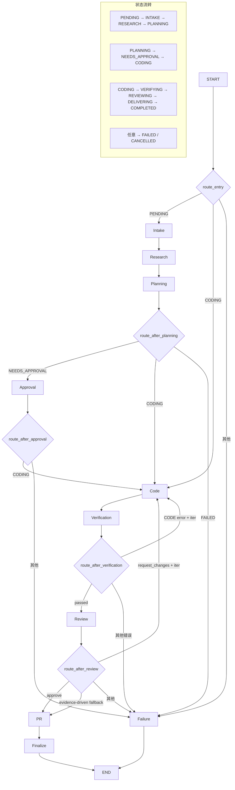
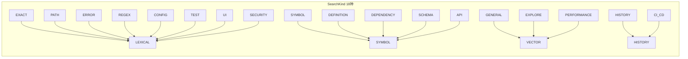
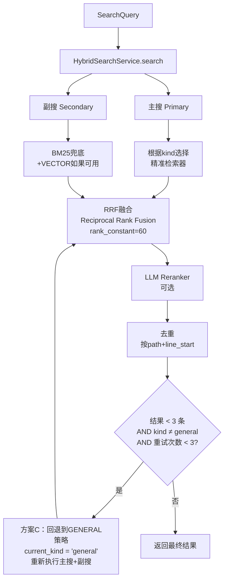
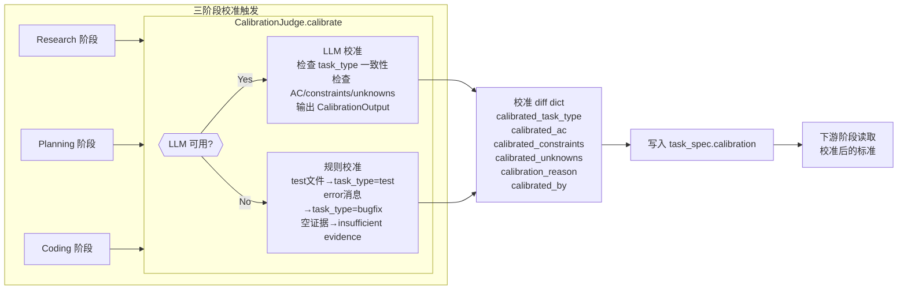
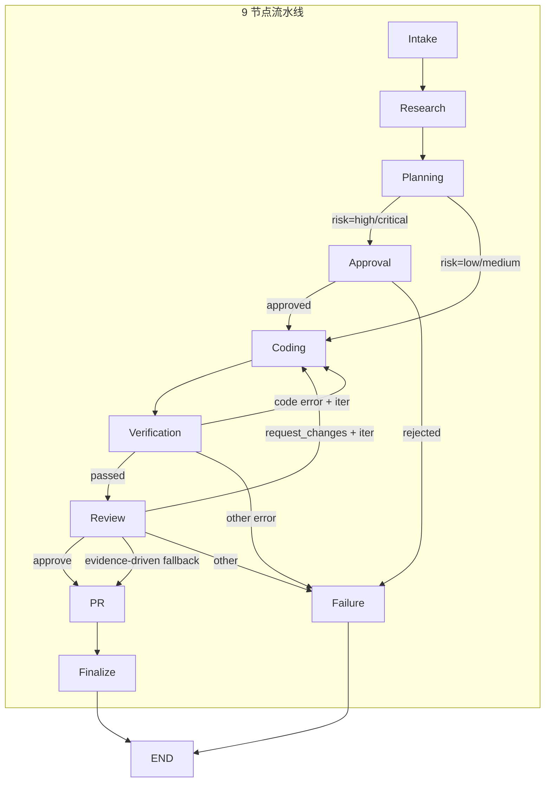

# RepoAegis 完整架构流程图

## 1. 整体流水线（Graph 编排 — 9 节点 + 条件路由）



## 2. Intake + Research 搜索链路（核心修改）

```mermaid
flowchart LR
    subgraph Intake
        I1[GitHub Issue] --> I2[LLM structured output]
        I2 --> I3[task_spec\ntask_type, summary,\nac, constraints, unknowns]
    end

    subgraph Rewriter
        R1[LLM Rewriter] --> R2[queries\n18种SearchKind + key_paths]
        R3[规则版Rewriter\n正则检测] --> R2
    end

    subgraph Research
        RE1[issue_text] --> R1
        RE1 --> R3
        R2 --> RE2[搜索循环\n每个query传kind\nper_query_top_k = max(3, min(8, 24//n))]
    end

    subgraph Search
        RE2 --> S1[ToolCall\nsearch_code]
        S1 --> S2[SearchAdapter\n读取kind参数]
        S2 --> S3[SearchQuery\n含kind字段]
        S3 --> S4[WorkspaceIndex.search\n传递kind到HybridSearchService]
    end

    Intake --> Research
```

## 3. SearchKind 映射表（需求侧18种 → 供给侧 QueryKind 策略）



### 映射表详细策略

| SearchKind | 主搜 QueryKind | 副搜 QueryKind | 启用 Reranker | 用途 |
|---|---|---|---|---|
| EXACT | LEXICAL + BM25 | BM25 | ❌ | 精确标识符、错误字符串、引号内文本 |
| PATH | LEXICAL + BM25 | BM25 | ❌ | 文件路径提示 |
| ERROR | LEXICAL + BM25 | BM25 | ❌ | 错误消息、Traceback、异常文本 |
| REGEX | LEXICAL + BM25 | BM25 | ❌ | 正则表达式模式匹配 |
| CONFIG | LEXICAL + BM25 | BM25 | ❌ | 配置相关查询 |
| UI | LEXICAL + BM25 | BM25 | ❌ | 前端 UI 相关查询 |
| SECURITY | LEXICAL + BM25 | BM25 | ❌ | 安全漏洞相关查询 |
| TEST | LEXICAL + BM25 | BM25 + VECTOR | ❌ | 测试相关查询 |
| SYMBOL | SYMBOL + BM25 | BM25 + VECTOR | ✅ | CamelCase 符号、类名、函数名 |
| DEFINITION | SYMBOL + BM25 | BM25 + VECTOR | ✅ | 定义查询 |
| API | SYMBOL + BM25 | BM25 + VECTOR | ✅ | API 接口相关查询 |
| DEPENDENCY | LEXICAL + BM25 + SYMBOL | BM25 | ❌ | 依赖/导入语句 |
| SCHEMA | SYMBOL + BM25 + VECTOR | BM25 + VECTOR | ✅ | 数据库 schema、模型定义、数据类 |
| PERFORMANCE | BM25 + VECTOR | BM25 + VECTOR | ✅ | 性能优化相关查询 |
| GENERAL | BM25 + VECTOR + OPENSEARCH | BM25 + VECTOR | ✅ | 通用自然语言描述 |
| EXPLORE | VECTOR + BM25 | BM25 + VECTOR | ✅ | 探索性查询 |
| HISTORY | HISTORY + BM25 | BM25 | ❌ | Git 历史查询 |
| CI_CD | LEXICAL + BM25 + HISTORY | BM25 | ❌ | CI/CD 配置相关查询 |

## 4. 主搜 + 副搜并行策略 + 搜索重试机制



**方案 C 说明（搜索重试机制）：**

```
while len(fused) < 3 and retry_count < 3 and current_kind != "general":
    retry_count += 1
    current_kind = "general"          # 回退到 GENERAL 策略
    primary_kinds = _resolve_primary_kinds(query, kind="general")
    secondary_kinds = _resolve_secondary_kinds("general")
    重新执行主搜 + 副搜并行
    重新 RRF 融合
```

- 当初始搜索结果少于 3 条时触发
- 自动将搜索策略回退到 GENERAL（BM25 + VECTOR + OPENSEARCH）
- 最多重试 3 次，每次使用更宽泛的检索器
- 确保即使精准搜索失败也能返回足够结果

## 5. CalibrationJudge 校准流程（三阶段校准）



### CalibrationJudge 详细流程

**设计原则：**
- 独立于 Intake：不直接修改 Intake 输出
- 三阶段平等：Research / Planning / Coding 任一阶段均可触发校准
- 证据驱动：校准决定基于显式证据，非 LLM 猜测
- 增量覆盖：结果存储为 diff/overlay，非全量替换

**LLM 校准流程：**
1. 构建校准提示词，包含当前 task_spec + 新证据摘要 + 触发阶段
2. 调用 LLM 输出 `CalibrationOutput`（含 calibrated_task_type, calibrated_ac, calibrated_constraints, calibrated_unknowns, calibration_reason）
3. 如果 LLM 调用失败，自动回退到规则校准

**规则校准规则：**
1. 证据包含 test 文件（`test_` / `/test/` / `/tests/`）但 task_type 不是 `test` → 建议 `test`
2. 证据包含 error 消息（`error` / `exception`）但 task_type 不是 `bugfix` → 建议 `bugfix`
3. 证据为空 → 标记为 `insufficient evidence`

## 6. 审批信封（ApprovalEnvelope）详细流程

```mermaid
flowchart TD
    PL[Planning] --> AE[ApprovalEnvelope]
    AE --> H[plan_hash\nSHA256(plan_json)]
    AE --> TC[target_commit\n目标提交 SHA]
    AE --> DF[declared_files\n声明将修改的文件]
    AE --> AT[allowed_tools\n允许的工具权限]
    AE --> VP[verification_plan\n验证计划]

    H --> INT[LangGraph interrupt\n等待人工审批\ninterrupt()]

    INT --> DEC{Approved?}
    DEC -->|Yes| AD[ApprovalDecision\napproved=true\napprover, plan_hash,\ntarget_commit,\nallowed_tools, reason,\ndecided_at]
    DEC -->|No| AD2[ApprovalDecision\napproved=false]

    AD --> CD[Coding\n使用allowed_tools执行]
    AD2 --> FAIL[Failed]

    subgraph Digest[plan_hash 计算]
        D1[plan = tuple[dict]] --> D2[model_dump JSON]
        D2 --> D3[json.dumps sort_keys]
        D3 --> D4[sha256 hexdigest]
    end
```

### ApprovalEnvelope 字段说明

| 字段 | 类型 | 说明 |
|---|---|---|
| `plan` | `tuple[dict, ...]` | 规划步骤列表，每个步骤包含操作详情 |
| `target_commit` | `str (SHA)` | 审批对应的目标提交 |
| `allowed_tools` | `tuple[ToolPermission, ...]` | 允许 Coding 阶段使用的工具权限（自动去重排序） |
| `declared_files` | `tuple[str, ...]` | 声明将修改的文件路径列表（自动去重排序） |
| `verification_plan` | `tuple[str, ...]` | 验证计划命令列表 |

**流程：**
1. Planning 阶段生成 `ApprovalEnvelope`，包含完整计划、目标提交、声明文件、允许工具、验证计划
2. 计算 `plan_hash = SHA256(JSON(plan, sort_keys=True))`
3. 通过 `LangGraph interrupt()` 暂停流水线，等待人工审批
4. 人工审批返回 `ApprovalDecision`（含 approved、approver、plan_hash、target_commit、allowed_tools、reason、decided_at）
5. 审批通过 → 进入 Coding 阶段（使用 `allowed_tools` 执行）
6. 审批拒绝 → 进入 Failed

## 7. 9 节点流水线详细说明

### 节点职责

| 节点 | 状态 | 核心功能 |
|---|---|---|
| **Intake** | INTAKE | 将 GitHub Issue 转为结构化 task_spec（task_type, summary, ac, constraints, unknowns） |
| **Research** | RESEARCH | 搜索代码库 + 证据收集 + Localizer 定位（3 轮循环） |
| **Planning** | PLANNING | 基于证据制定修改计划，风险评级（low/medium/high/critical） |
| **Approval** | NEEDS_APPROVAL | 高风险/高影响任务进入人工审批流程 |
| **Coding** | CODING | 执行修改计划，生成 patch（最多 2 次尝试） |
| **Verification** | VERIFYING | 沙箱验证，执行测试/检查命令 |
| **Review** | REVIEWING | LLM 代码审查，决策 approve/request_changes |
| **PR** | DELIVERING | 创建 Pull Request（git commit + push + gh pr create） |
| **Failure** | FAILED | 错误处理，记录失败原因 |

### 路由决策



**路由函数说明：**

- **route_entry**：PENDING → intake；CODING（恢复）→ code；其他 → failure
- **route_after_planning**：NEEDS_APPROVAL → approval；CODING → code；FAILED → failure
- **route_after_approval**：CODING → code；其他 → failure
- **route_after_verification**：passed → review；CODE error + iteration < max_iterations → code（重试）；其他 → failure
- **route_after_review**：approve → pr；request_changes + iteration < max → code（重试）；evidence-driven fallback（已验证通过 + 低风险 + 文件在声明范围内）→ pr；其他 → failure
