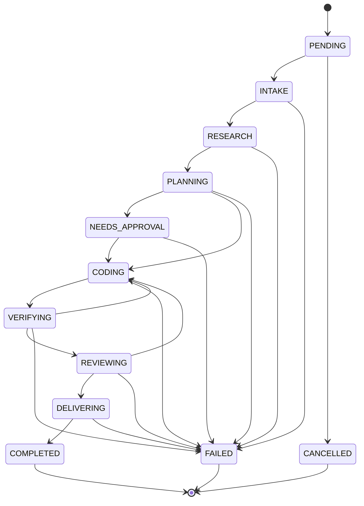

# 系统架构

> 本文描述 RepoAegis **当前实现**的架构，所有结论均对照 `src/repo_maintenance_agent` 源码核实。
> 如果这里的描述与代码出现分歧，以代码为准，并欢迎提 PR 修正本文。
> 面向未来阶段的产品蓝图见 [`../RepoAegis_Design.md`](../RepoAegis_Design.md)；两者的关系是"设计参考 vs 已验证的现状"。

## 1. 一句话定位

RepoAegis 把一个 GitHub Issue，通过一条状态机驱动的流水线，转成一份**有证据支撑、经过沙箱验证、需要人工审批才能落地**的 Pull Request：

```text
Issue → 结构化任务 → 检索定位代码 → 生成计划 → 人工审批 → 沙箱内改代码 → 验证 → 复审 → 建 PR
```

它不是"聊天式代码助手"：每个阶段的输出都是结构化数据（Pydantic 模型），阶段之间不依赖对话历史，失败和重试路径是图里显式画出来的边，不是模型的自由发挥。

## 2. 分层视图

代码按职责分层，依赖方向单向：`graph → agents → search/tools/domain`。

| 层 | 目录 | 职责 |
|---|---|---|
| 编排层 | `graph/` | LangGraph `StateGraph` 构建（`builder.py`）、共享状态（`state.py`）、条件路由（`routes.py`） |
| Agent 层 | `agents/` | 9 个节点的具体实现（`nodes.py`）、任务定位（`localizer.py`）、校准（`calibration.py`）、查询改写（`query_rewriter.py`）、补丁渲染（`patches.py`） |
| 领域模型层 | `domain/` | 核心数据结构与状态机（`models.py`）、端口协议（`ports.py`）、错误类型（`errors.py`） |
| 检索层 | `search/` | 混合检索的路由、融合、各类检索器实现，见 [`search-system.md`](search-system.md) |
| 工具层 | `tools/` | 统一的工具实现（search、git、github、patch、process 等），是 Agent 与外部世界之间唯一的通道 |
| 策略层 | `policies/` | 权限（`permissions.py`）、风险判定（`risk.py`）、脱敏（`redaction.py`），见 [`approval-and-safety.md`](approval-and-safety.md) |
| 沙箱层 | `sandbox/` | Docker 执行隔离（`docker.py`）、验证器、远程 runner |
| 存储层 | `storage/` | 任务状态、队列、审计日志、Artifact 持久化 |
| 接入层 | `api/` | FastAPI 后端 |
| 前端 | `web/` | Vite + React 控制台 |

控制面统一使用 Python：主要负载是模型调用、检索、GitHub API 和沙箱调度，属于 I/O 密集型工作，Python 在 LangGraph、结构化输出、评测生态上的成熀度足够支撑这个闭环。沙箱执行面语言无关——被维护仓库可以是任何语言，Docker 镜像按仓库语言切换。

## 3. 任务状态机

`RepoTaskState.status`（`domain/models.py`）是整条流水线的事实来源，一共 12 个状态，转换关系由 `_TRANSITIONS` 显式声明并在 `transition()` 里强制校验——非法跳转会抛 `InvalidStateTransition`，不存在"状态跳过"的空子。



任意状态都能转到 `CANCELLED`（图中为省略重复箭头未逐一画出，实际由 `_TRANSITIONS` 中每个非终态条目都包含 `CANCELLED` 保证）。`COMPLETED`、`FAILED`、`CANCELLED` 是终态，没有出边。

## 4. 9 节点流水线

`graph/builder.py` 里的 `build_graph()` 把 `AgentNodes`（9 个节点 + `failure`）接成一张图，另加一个不接受重试的 `finalize` 收尾节点：

```text
START → route_entry → intake → research → planning → route_after_planning
    → (approval | code | failure)
approval → route_after_approval → (code | failure)
code → verification → route_after_verification → (code | review | failure)
review → route_after_review → (code | pr | failure)
pr → finalize → END
failure → END
```

每个节点对应 `agents/nodes.py::build_agent_nodes()` 里的一个闭包，共用同一个 `AgentRuntime`（一个 model + 一个 gateway + 有界的上下文/补丁重试预算）。

| 节点 | 状态 | 职责 | 读写权限（见 `policies/permissions.py`） |
|---|---|---|---|
| **Intake** | `INTAKE` | 把 GitHub Issue 转成结构化 `TaskSpecOutput`（task_type / summary / acceptance_criteria / constraints / unknowns） | `github_read` |
| **Research** | `RESEARCH` | Rewriter 生成检索查询 → `HybridSearchService` 并行检索 → Localizer 循环定位证据 | `github_read` + `repo_read`；内部 Localizer 单独持有 `repo_read` |
| **Planning** | `PLANNING` | 基于证据生成 `PlanOutput`，用 `deterministic_risk` + LLM 风险判断取更严格值 | `repo_read` |
| **Approval** | `NEEDS_APPROVAL` | 高风险任务在此中断（`langgraph.types.interrupt`），等待人工审批 `ApprovalDecision` | 无独立工具权限，只做审批判定 |
| **Coding** | `CODING` | 收集上下文 → 生成并应用 `PatchProposal`（最多 `max_patch_attempts` 次） | `repo_read` + `sandbox_write` + `sandbox_execute` |
| **Verification** | `VERIFYING` | 在沙箱内跑验证命令，产出 `VerificationResult`，失败按 `ErrorKind` 分类 | `repo_read` + `sandbox_execute` |
| **Review** | `REVIEWING` | 独立于 Coding 的复审，输出 `approve` / `request_changes` | `repo_read` |
| **PR** | `DELIVERING` | 生成分支、commit、PR 描述，`git_write` + `github_write` 必须有匹配的人工审批 | `repo_read` + `git_write` + `github_read` + `github_write` |
| **Failure** | `FAILED` | 记录失败原因，流程终止 | — |

路由函数（`graph/routes.py`）都是纯函数，只读 `GraphState["task"]`：

- `route_entry`：`PENDING → intake`；恢复态 `CODING → code`；其他一律 `failure`。
- `route_after_planning`：`NEEDS_APPROVAL → approval`；`FAILED → failure`；否则 `code`。
- `route_after_approval`：`CODING → code`；否则 `failure`。
- `route_after_verification`：验证通过 → `review`；`error_kind == CODE` 且 `iteration < max_iterations` → 回 `code` 重试；其余错误（`baseline_failure` / `environment_failure` / `infrastructure_failure`）一律 `failure`，不会误当作"代码问题"反复重试。
- `route_after_review`：`approve → pr`；`request_changes` 且还有重试预算 → 回 `code`；**证据驱动兜底**——即便复审仍是 `request_changes`，只要验证已通过、改动文件是已声明文件集合的子集、且用 `deterministic_risk` 复核无风险原因，也放行到 `pr`（复审的警告仍保留在 `review` 记录里，不是被悄悄抹掉）；其余情况 `failure`。

## 5. 迭代与预算

- `RepoTaskState.iteration` / `max_iterations`（默认 3，允许 1–10）控制 Coding ↔ Verification/Review 之间的回退次数上限，防止无限修复循环。
- `AgentRuntime.max_context_rounds`、`max_context_tool_calls`、`max_patch_attempts` 分别约束 Research 阶段的上下文收集轮数、单轮工具调用数、Coding 阶段的补丁生成重试次数。
- 这些预算都是构造时校验的硬边界（超出范围直接 `ValueError`），不是运行时"尽量遵守"的软约束。

## 6. 文件地图

| 关注点 | 文件 |
|---|---|
| 状态机 / 核心领域模型 | `domain/models.py` |
| 图编排 / 路由 | `graph/builder.py`, `graph/routes.py`, `graph/state.py` |
| 9 节点实现 | `agents/nodes.py` |
| Issue → 结构化任务 | `agents/schemas.py` → `TaskSpecOutput` |
| 定位循环（Planner + Explorer） | `agents/localizer.py` |
| 三阶段校准 | `agents/calibration.py` → `CalibrationJudge` |
| 混合检索 | `search/`（见 [`search-system.md`](search-system.md)） |
| 权限 / 风险 / 脱敏 | `policies/permissions.py`, `policies/risk.py`, `policies/redaction.py` |
| Docker 沙箱 | `sandbox/docker.py` |
| FastAPI 后端 | `api/` |
| 前端控制台 | `web/` |

## 延伸阅读

- [`search-system.md`](search-system.md) — 混合检索子系统的完整设计与实现细节。
- [`approval-and-safety.md`](approval-and-safety.md) — 审批信封、权限系统、沙箱隔离、脱敏的信任边界设计。
- [`architecture-flow.md`](architecture-flow.md) — 以上内容的 Mermaid 流程图合集，适合快速对照代码位置。
- [`../RepoAegis_Design.md`](../RepoAegis_Design.md) — 完整的生产级参考架构（含尚未落地的阶段性规划）。
- [`refactor-plan.md`](refactor-plan.md) — 对照源码的现状核实、已知差距和改造优先级。
